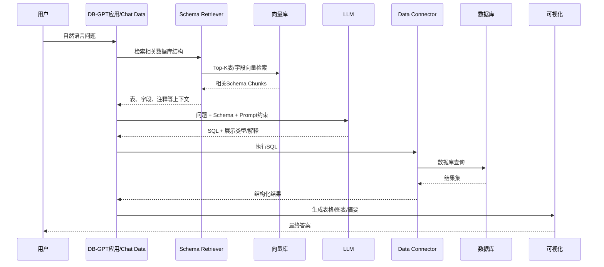
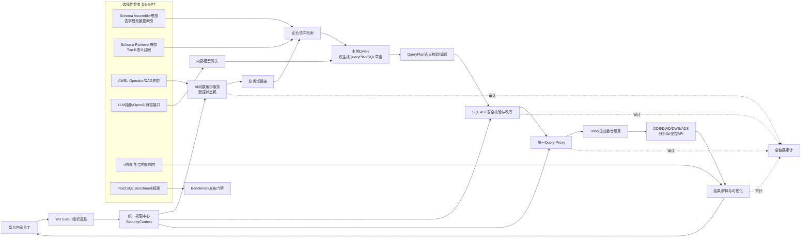

# DB-GPT 对华为 AIDataSmartRequest 智能问数平台的参考价值与复用设计分析

> 文档类型：开源项目技术解析 / 参考架构 / 复用建议  
> 研究对象：`eosphoros-ai/DB-GPT`  
> 对照项目：华为内部 AI 智能问数平台 AIDataSmartRequest  
> 分析快照日期：2026-07-28  
> 结论级别：架构与源码调研结论，正式落地前应固定 DB-GPT Tag/Commit 并完成安全、许可证与供应链复核

---

## 1. 执行摘要

DB-GPT 是一个面向 AI 与数据融合场景的开源数据助手与开发框架。其当前主线能力已从早期的“数据库聊天工具”扩展为由 **数据源连接、数据库 Schema 检索、Text-to-SQL、AWEL 工作流、Agent、模型抽象、RAG、可视化、技能与沙箱执行**组成的综合型平台。

对于 AIDataSmartRequest，DB-GPT 的最高价值不是“整套系统拿来直接部署”，而是作为以下模块的成熟技术参考与部分源码复用来源：

1. **数据库 Schema 采集、切分、向量化和按问题召回**；
2. **AWEL 的 DAG/Operator 工作流编排思想**；
3. **LLM、Embedding、存储和数据源的抽象接口设计**；
4. **Qwen 与 OpenAI 兼容模型接口的接入方式**；
5. **自然语言 → 相关 Schema → Prompt → SQL → 执行结果 → 图表/摘要**的核心问数链路；
6. **Text-to-SQL Benchmark、执行正确率和结果正确率评测思路**；
7. **场景化应用、会话、数据源、模型、Prompt、RAG 服务的模块划分**。

但 DB-GPT 的默认产品路径允许应用或 Agent 持有数据源配置并执行 SQL，这与 AIDataSmartRequest 的安全边界并不一致。华为项目必须继续坚持：

- Qwen 不持有数据库账号；
- Qwen 不直接连接数据源；
- Qwen 优先生成结构化 `QueryPlan`，SQL 仅为候选草案；
- 所有查询经过 `SecurityContext`、语义校验、SQL AST 安全改写和 `Query Proxy`；
- W3 SSO、组织属性、RBAC+ABAC、行列权限、指标权限、缓存隔离、导出控制和全链路审计由企业平台自行实现；
- DB-GPT 的“自动执行 SQL、自由 Agent、自主代码执行”不得原样进入首期生产主链路。

**总体建议：将 DB-GPT 定位为“AI 问数核心能力参考框架与可选择复用的技术组件”，而不是华为智能问数平台的完整生产底座。**

---

## 2. 分析输入与边界

本分析综合以下输入：

1. DB-GPT 官方 GitHub 主仓库、官方文档、源码结构说明、AWEL Chat Data 教程、Datasource API、Benchmark 文档和 Release 信息；
2. 《AIDataSmartRequest 华为内部 AI 智能问数平台落地实施方案 V1.1》；
3. 用户提供的“华为 AI 智能问数平台总体架构”六层架构图。

AIDataSmartRequest 当前架构的关键约束为：

- 用户通过公司内网、VPN 或零信任接入；
- W3 Uniportal SSO 完成身份认证；
- 组织与用户属性服务提供部门、BG/BU、区域和岗位；
- 统一权限中心输出不可由前端修改的 `SecurityContext`；
- 企业语义层管理指标、维度、Join、业务术语和 Golden Query；
- 本地 Qwen 负责意图理解、查询计划、受限 Text-to-SQL 和结果解释；
- SQL 经 AST、只读、白名单、行列权限、LIMIT、超时和扫描量校验；
- Query Proxy 是唯一执行出口；
- 查询访问 ODS/DWD/DWS/ADS、分析数据库或受控数据 API；
- 全链路审计覆盖身份、问题、语义版本、模型版本、SQL、权限决策和执行结果。

因此，本分析重点不是“DB-GPT 能否回答数据库问题”，而是：

> DB-GPT 的哪些机制能提高 AIDataSmartRequest 的研发效率、语义召回效果、Text-to-SQL 稳定性和工程可扩展性，同时不破坏华为项目已有的身份、权限和统一查询出口设计。

---

## 3. DB-GPT 当前定位与总体能力

### 3.1 项目定位

DB-GPT 官方将其定位为开源的 Agentic AI 数据助手，能够连接数据库、CSV/Excel、数据仓库和知识库，使用自然语言生成 SQL 或代码，执行分析流程，并生成图表、Dashboard、HTML 报告和摘要。

当前主要能力包括：

- 自然语言问数和 Text-to-SQL；
- SQL 与 Python 数据分析；
- 数据库、文件、数仓和知识库的多源访问；
- AWEL 工作流；
- Agent 与工具调用；
- RAG 和向量检索；
- 多模型管理与模型适配；
- 可视化和报告生成；
- Skills 可复用领域能力；
- 沙箱中的代码或工具执行；
- Text-to-SQL 微调和 Benchmark。

截至本次分析快照，官方 Release 页面显示最新版本为 `v0.8.0`，发布时间为 2026-03-27。主仓库采用 MIT License。由于主分支持续变化，后续工程必须固定 Tag 或 Commit，不能永远追着 `main` 跑。追主分支在演示环境叫敏捷，在生产环境通常叫给自己安排夜班。

### 3.2 DB-GPT 与 AIDataSmartRequest 的目标差异

| 对比维度 | DB-GPT 默认定位 | AIDataSmartRequest 定位 |
|---|---|---|
| 用户范围 | 通用团队或开发者 | 华为内部员工 |
| 身份体系 | DB-GPT API Key、平台用户或外部集成 | W3 SSO + 组织属性 |
| 数据访问 | 数据源配置后由框架/Agent连接并执行 | Query Proxy 唯一执行出口 |
| 权限模型 | 通用应用权限，需二次开发 | RBAC+ABAC、业务域/表/行/列/指标权限 |
| 模型行为 | 可自主生成并执行 SQL/代码 | 受控生成 QueryPlan 或 SQL 草案 |
| 语义能力 | Schema RAG、Prompt、知识库、技能 | 企业指标语义、口径、Join、Golden Query、血缘 |
| 安全目标 | 私有部署、脱敏、沙箱和工具控制 | 身份贯穿、零越权、AST 改写、审计、数据最小化 |
| 生产治理 | 通用框架能力 | 企业级发布门禁、Benchmark、审计与回滚 |

这意味着 DB-GPT 和华为项目并不是“谁替代谁”的关系。更准确的关系是：

```text
DB-GPT
  └─ 提供 AI + Data 的通用技术积木、源码参考和工作流思想

AIDataSmartRequest
  └─ 在企业身份、权限、语义治理、SQL安全、统一查询出口和审计边界内
     选择性吸收这些积木
```

---

## 4. DB-GPT 的代码与服务架构

DB-GPT 官方代码设计说明将核心工程拆分为六类包：

```text
packages/
├── dbgpt-core          # 核心抽象、接口、组件系统、AWEL
├── dbgpt-serve         # REST服务层
├── dbgpt-app           # 应用启动、业务场景、编排和OpenAPI
├── dbgpt-client        # Python SDK与OpenAI兼容客户端
├── dbgpt-ext           # 数据源、LLM、向量库、RAG、可视化扩展
└── dbgpt-accelerator   # 推理和计算加速
```

### 4.1 `dbgpt-core`：抽象与编排基础

关键价值：

- `SystemApp` 组件注册、依赖注入和生命周期；
- LLM、Embedding、Storage、Message 等统一接口；
- AWEL 的 DAG、Operator、Trigger、Flow；
- 让上层业务依赖抽象，而不是直接绑定具体模型或向量库。

对华为项目的启示：

- `askdata-orchestrator` 不要在业务代码里写死 Qwen、pgvector、Trino 或某个数据库客户端；
- 模型、Embedding、Rerank、语义检索、QueryPlan 编译器和执行器应有独立接口；
- 编排节点应有统一生命周期、输入输出 Schema、超时、重试和监控钩子。

### 4.2 `dbgpt-serve`：服务化接口层

官方结构覆盖：

- Agent 服务；
- Conversation 会话服务；
- Datasource 数据源服务；
- Flow 工作流服务；
- Model 模型服务；
- RAG 服务；
- Prompt 服务。

可参考点：

- 按能力域划分 REST API；
- 将数据源、模型、Prompt、会话、流程等管理接口与业务应用解耦；
- 管理面与运行面尽量分离。

### 4.3 `dbgpt-app`：场景与业务编排

`dbgpt-app` 是完整应用入口，负责：

- FastAPI 启动；
- 组件初始化；
- 路由挂载；
- 数据库迁移；
- 场景实现；
- OpenAPI。

其 `scene/` 目录按场景组织 Chat Data、Chat DB、知识库问答、Dashboard 等逻辑。这种“场景层”值得参考，但不建议把 DB-GPT 的完整 Web 应用直接嵌入华为生产门户。更稳妥的方式是将其能力封装为内部适配库或独立 PoC 服务。

### 4.4 `dbgpt-client`：标准客户端

关键价值：

- 统一异步 Python SDK；
- OpenAI 兼容接口；
- 对聊天、流式返回、数据源、应用、流程和知识库管理提供统一调用方式。

对华为项目的启示：

- `model-gateway` 可提供 OpenAI 兼容接口，方便 Qwen 推理平台、DB-GPT 适配层和其他内部应用接入；
- 对外只暴露华为自己的 `/api/v1/query/stream`，内部模型调用仍可使用标准化接口；
- 不要把 DB-GPT 的 Datasource API 直接暴露给普通员工。

### 4.5 `dbgpt-ext`：连接器和扩展

关键价值：

- 数据源 Connector；
- 向量存储适配器；
- LLM Provider；
- RAG 实现；
- 可视化扩展。

这是源码复用价值最高的区域之一。华为项目可以参考其接口和部分连接器实现，但数据库凭据仍必须由 `sql-engine-adapter` 或 `Query Proxy` 管理，不能被问数编排服务或模型进程持有。

### 4.6 `dbgpt-accelerator`：性能扩展

可以用于研究：

- 本地模型加速；
- 硬件能力探测；
- 推理依赖按需安装；
- 无加速能力时的降级。

但若华为已有统一内部推理平台，本模块的直接复用价值会低于模型接口和网关抽象价值。

---

## 5. DB-GPT 的核心问数工作方式

DB-GPT 官方 AWEL Chat Data 教程把核心过程拆为两个阶段：

1. **构建数据库知识库**：解析数据库 Schema 和相关信息并写入向量存储；
2. **自然语言问数**：按问题检索相关 Schema，将问题与上下文交给 LLM 生成 SQL，执行 SQL，返回结果。

这套机制解释了“模型没有把整库背下来，为什么仍然知道表和字段”。模型只在每次请求时得到与当前问题相关的 Schema 片段。

### 5.1 阶段一：数据源注册与 Schema 采集

DB-GPT 的数据源模块记录数据库类型、数据库名称、连接地址和凭据等配置，并通过 Connector 访问数据库元数据。

典型步骤：

```text
管理员注册数据源
    ↓
Datasource Service 创建数据源配置
    ↓
Connector 连接数据库
    ↓
读取 Catalog / Schema / Table / Column / Comment / Relation
    ↓
将元数据整理成文档块
```

在 AIDataSmartRequest 中，应调整为：

```text
数据平台管理员批准数据源
    ↓
sql-engine-adapter / 元数据采集服务持有只读元数据账号
    ↓
采集白名单视图、字段、注释、关系、更新时间、敏感等级
    ↓
写入企业语义层
    ↓
模型侧永远看不到真实数据库账号、密码和物理地址
```

### 5.2 阶段二：Schema 组装与向量化

DB-GPT 提供 `DBSchemaAssemblerOperator`，将 Connector 返回的数据库结构加载为 Schema 文档块，并持久化到向量存储。

可抽象为：

```text
BaseConnector
   ↓ 读取表和字段元数据
DBSchemaAssembler
   ↓ 结构化、切分、生成Chunk
Embedding Model
   ↓ 向量化
Table Vector Store / Field Vector Store
```

可保存的内容通常包括：

- 数据库逻辑名称；
- 表名与表注释；
- 字段名、类型和注释；
- 主键、外键或可推断关系；
- 部分样例信息；
- 方言或数据库类型。

对华为项目而言，不能只保存“物理 Schema”，还应扩展为：

```text
物理元数据
+ 指标定义
+ 维度定义
+ 业务术语和同义词
+ 时间口径
+ Join白名单
+ 默认过滤条件
+ 敏感等级
+ 数据负责人
+ 数据质量状态
+ Golden Query
+ 语义版本
```

因此，DB-GPT 的 Schema 索引只能作为华为“企业语义层”的底座之一，不能等价替代完整语义层。

### 5.3 阶段三：按用户问题检索相关 Schema

`DBSchemaRetrieverOperator` 使用用户问题检索最相关的表级和字段级向量片段，返回 Top-K Schema 上下文。

例如用户问题：

```text
查询今年华南区域各产品线的销售额及同比
```

检索可能返回：

```text
候选表：ads_sales_summary
相关字段：stat_date、region_code、product_line、sales_amount
候选维度：region、product_line、month
相关关系：ads_sales_summary.region_code = dim_region.region_code
```

这一设计的优点：

- 避免把数万张表全部塞入 Prompt；
- 降低 Token 消耗；
- 减少模型选择错误表和错误字段；
- 让不同业务域可以使用独立索引；
- 便于对召回率单独评测。

对 AIDataSmartRequest 必须增加的前置条件：

```text
用户问题
    ↓
SecurityContext 解析允许业务域和数据资产范围
    ↓
只在授权资产中进行关键词/向量/规则混合检索
    ↓
返回已过滤的 SemanticContext
```

**权限过滤必须发生在检索前或检索过程中，而不是等模型看到敏感表以后再祈祷它当作没看见。**

### 5.4 阶段四：Prompt 组装与 SQL 生成

DB-GPT Chat Data 教程的 Prompt 约束思想包括：

- 只能使用提供的表和字段；
- Schema 不足时不要编造；
- 控制返回数量；
- 输出 SQL 和可视化类型等结构化信息；
- 必要时拒绝回答。

输入模型的上下文大致为：

```text
用户问题
+ 相关Schema
+ 数据库方言
+ 表/字段描述
+ Prompt规则
+ 历史会话
```

模型输出通常包含：

```json
{
  "thoughts": "...",
  "sql": "SELECT ...",
  "display_type": "response_table"
}
```

对于 AIDataSmartRequest，建议把输出从“直接 SQL”升级为：

```json
{
  "domain": "sales",
  "metrics": ["sales_amount"],
  "dimensions": ["product_line"],
  "time_range": {
    "type": "year_to_date"
  },
  "filters": [
    {
      "field": "region",
      "operator": "in_authorized_scope"
    }
  ],
  "comparison": "year_over_year",
  "limit": 500,
  "visualization": "bar_chart",
  "confidence": 0.89
}
```

随后由确定性的语义编译器把 `QueryPlan` 转成 SQL。这样模型负责“理解和规划”，程序负责“确定性拼装与安全执行”。

### 5.5 阶段五：SQL 执行与结果返回

DB-GPT 的默认 Chat Data 路径可以使用 Connector 执行 SQL 并返回结果，再由可视化协议生成表格或图表。

AIDataSmartRequest 必须改造成：

```text
候选QueryPlan/SQL
    ↓
语义校验
    ↓
SQL AST解析与确定性权限改写
    ↓
Query Proxy
    ↓
Trino / 企业数仓服务 / 受控API
    ↓
结构化结果校验
    ↓
Qwen只对脱敏、授权后的结构化结果生成摘要
```

Qwen 不应拥有：

- DB Host；
- DB Port；
- DB User；
- DB Password；
- JDBC/DSN；
- 生产库写权限；
- 绕过 Query Proxy 的工具。

### 5.6 阶段六：结果可视化

DB-GPT 可以把 SQL 和查询结果包装为表格、图表或报告。可参考的能力包括：

- 根据数据形态选择表格、折线图、柱状图等；
- 将 SQL、数据和显示类型组织为结构化响应；
- 流式返回分析过程和最终结果；
- 将分析能力封装为可复用 Skill。

华为项目应增加：

- 指标口径；
- 数据来源；
- 数据更新时间；
- 权限范围说明；
- 查询条件；
- 结果是否缓存；
- 导出权限；
- 脱敏说明；
- `request_id` 与审计追踪入口。

---

## 6. DB-GPT 核心问数链路图



这条链路适合 PoC 和通用数据助手，但对华为生产场景仍缺少：

- W3 身份；
- SecurityContext；
- 业务域路由；
- 指标语义；
- Golden Query；
- SQL AST 权限改写；
- Query Proxy；
- 缓存隔离；
- 数据质量门禁；
- 全链路审计。

---

## 7. DB-GPT 语义分析能力的真实边界

### 7.1 DB-GPT 擅长的“语义”

DB-GPT 的核心语义能力主要属于 **Schema-aware RAG + LLM 语义理解**：

1. 把表和字段转换为可检索文本；
2. 使用 Embedding 建立向量索引；
3. 根据自然语言问题召回相关 Schema；
4. 将 Schema、问题和约束交给 LLM；
5. 让模型推断查询表、字段、过滤、聚合和 Join；
6. 生成 SQL 或分析步骤。

这对以下问题非常有效：

- 表数量较多，Prompt 放不下全部 Schema；
- 用户使用自然语言而非字段名；
- 需要从描述中识别相关表；
- 需要在多个候选字段中选择最相关字段；
- 需要对 SQL 方言和结果可视化做适配。

### 7.2 DB-GPT 不天然等于企业指标语义层

企业智能问数还需要解决：

- “销售额”和“收入”是不是同一指标；
- 指标是否含税；
- 取消订单是否排除；
- 财务季度和自然季度如何转换；
- 哪个 ADS 视图是权威来源；
- 指标允许按哪些维度下钻；
- 一个字段在不同业务域是否同名异义；
- 哪条 Join 路径经过业务确认；
- 用户能否查看指标、明细和导出；
- 数据延迟时是否允许生成结论。

这些不是把字段注释向量化就会自动从宇宙中长出来的。华为项目仍须建设独立企业语义层。

### 7.3 推荐的华为企业语义对象

```yaml
metric:
  code: sales_amount
  name: 销售额
  synonyms: [营业额, 销售金额]
  formula: SUM(ads_sales_summary.sales_amount)
  default_filters:
    - order_status = 'COMPLETED'
  time_dimension: stat_date
  allowed_dimensions: [region, product_line, month, quarter]
  sensitivity: L2
  owner: sales_data_team
  version: sales-domain-v12

relation:
  left_entity: ads_sales_summary
  right_entity: dim_region
  join_type: LEFT
  join_key: region_code
  cardinality: N:1
  verified: true

asset_policy:
  business_domain: sales
  allowed_roles: [SALES_VIEWER, SALES_MANAGER]
  row_scope: region_code in SecurityContext.region_codes
  masked_columns: []
  export_policy: aggregate_only
```

DB-GPT 的 Schema Chunk 可以作为以上对象的检索载体，但企业语义对象本身应由数据负责人和业务负责人治理、版本化和评审。

---

## 8. DB-GPT 与华为总体架构的模块映射

| 华为架构模块 | DB-GPT 可参考模块 | 参考/复用方式 | 必须改造的部分 | 推荐级别 |
|---|---|---|---|---|
| 智能问数 Web 前端 | `web/`、Chat Data UI、可视化响应 | 参考交互、流式输出、图表协议 | 接入内部门户、W3、导出策略、内部UI规范 | 中 |
| 会话管理服务 | `dbgpt-serve/conversation`、Message接口 | 参考会话模型与流式消息 | 会话绑定W3员工ID、权限版本、审计ID | 中高 |
| AI问数编排服务 | AWEL DAG/Operator、`dbgpt-app/scene` | 参考工作流节点、DAG、状态和异步调用 | 改为显式受控状态机，禁止自由Agent直接执行 | 高 |
| 业务域识别与路由 | 场景路由、Prompt、Skill | 参考场景分类和可扩展能力包 | 与SecurityContext交叉校验，禁止无权限域 | 中 |
| 语义与元数据检索 | `DBSchemaAssemblerOperator`、`DBSchemaRetrieverOperator`、RAG | 直接参考Schema采集、Chunk、Embedding、Top-K召回 | 增加指标、维度、Join、Golden Query、权限过滤、语义版本 | 很高 |
| 本地Qwen模型服务 | LLM抽象、Provider、OpenAI兼容接口、Qwen支持 | 参考统一模型接口与配置 | 统一经过内部model-gateway、脱敏、限流、审计 | 高 |
| 模型服务网关 | SMMF、Model Serve、Client | 参考模型路由、标准接口和异步调用 | 增加内部服务身份、Prompt审批、模型版本门禁 | 高 |
| SQL安全校验与改写 | Prompt约束、SQL输出解析、部分SQL工具 | 仅参考输出解析和方言处理 | AST、权限注入、白名单、危险函数、成本控制必须自研/企业组件 | 低至中 |
| 统一权限中心 | 通用用户/API鉴权 | 几乎不可直接复用 | W3、RBAC+ABAC、行列指标权限、SecurityContext自行实现 | 低 |
| Query Proxy | Connector与Datasource抽象 | 参考Connector接口和方言适配 | 独立执行服务、身份透传、队列、超时、缓存隔离、审计 | 中 |
| SQL查询引擎适配 | `dbgpt-ext/datasource` | 参考数据库连接器和扩展模式 | 凭据托管在Vault/平台，禁止编排/模型持有 | 中高 |
| 结果解释与可视化 | `dbgpt-ext/vis`、图表协议、报告生成 | 参考数据到图表的转换 | 增加口径、来源、更新时间、脱敏和导出策略 | 高 |
| 审计与监控 | 日志、模型调用和流程状态 | 参考埋点位置 | 建立企业全链路审计模型与不可抵赖记录 | 中 |
| Benchmark | DB-GPT Falcon Text2SQL评测 | 参考任务、执行、对比和报告框架 | 加入华为Golden Query、角色、越权、攻击、结果对账 | 很高 |
| 领域能力包 | Skills、Agents | 参考技能元数据、工具和知识封装 | 首期仅允许审核后的确定性Skill | 中高 |

---

## 9. 推荐的“DB-GPT 思想 + 华为安全边界”改造架构



核心思想：

- DB-GPT 提供的工作流、Schema RAG、模型抽象、连接器和可视化能力放在安全边界内；
- 华为自有的 W3、权限、SQL 策略、Query Proxy、审计和数据治理放在不可绕过的位置；
- 模型只能决定“建议查什么”，不能决定“是否允许查”以及“以哪个账号执行”。

---

## 10. 华为核心问数链路建议

### 10.1 推荐状态机

```text
RECEIVE_REQUEST
    ↓
LOAD_SESSION
    ↓
BUILD_SECURITY_CONTEXT
    ↓
NORMALIZE_QUESTION
    ↓
ROUTE_DOMAIN
    ↓
CHECK_DOMAIN_ACCESS
    ↓
MATCH_GOLDEN_QUERY
    ├─ 命中 → BUILD_TRUSTED_QUERY_PLAN
    └─ 未命中 → RETRIEVE_SEMANTIC_CONTEXT
                         ↓
                    CALL_QWEN
                         ↓
                    VALIDATE_QUERY_PLAN
    ↓
COMPILE_SQL
    ↓
SQL_AST_POLICY_CHECK_AND_REWRITE
    ↓
QUERY_PROXY_EXECUTE
    ↓
VALIDATE_RESULT
    ↓
GENERATE_SUMMARY_AND_VISUALIZATION
    ↓
AUDIT_AND_RETURN
```

### 10.2 为什么不直接照搬自由 Agent

DB-GPT 的 Agent 和 Skills 很适合探索性分析，但华为首期生产问数要求：

- 结果可复现；
- 节点可审计；
- 权限不可被 Prompt 修改；
- 工具清单固定；
- SQL 必须经过确定性检查；
- 超时和重试有边界；
- 模型不可自行选择任意数据源；
- 不开放任意 Python 代码执行。

因此可借鉴 Agent 的“工具抽象”和 Skill 的“能力封装”，但执行方式应是显式状态机，而非自由循环推理。

### 10.3 推荐接口契约

#### 语义检索请求

```json
{
  "request_id": "REQ-20260728-000001",
  "question": "查询今年华南各产品线销售额和同比",
  "domain": "sales",
  "security_context": {
    "employee_id": "W3-***",
    "allowed_domains": ["sales"],
    "region_codes": ["CN-SOUTH"],
    "allowed_actions": ["QUERY_AGGREGATE"]
  },
  "top_k": 12,
  "semantic_version": "sales-domain-v12"
}
```

#### 语义检索结果

```json
{
  "metrics": [
    {
      "code": "sales_amount",
      "formula": "SUM(sales_amount)",
      "time_dimension": "stat_date"
    }
  ],
  "dimensions": ["product_line", "region", "year"],
  "assets": ["ads_sales_summary"],
  "relations": [
    {
      "left": "ads_sales_summary.region_code",
      "right": "dim_region.region_code",
      "verified": true
    }
  ],
  "golden_queries": [],
  "constraints": {
    "region_scope": ["CN-SOUTH"],
    "aggregate_only": true
  },
  "semantic_version": "sales-domain-v12"
}
```

#### QueryPlan

```json
{
  "domain": "sales",
  "metrics": [
    {"name": "sales_amount", "calculation": "value"},
    {"name": "sales_amount", "calculation": "year_over_year"}
  ],
  "dimensions": [
    {"name": "product_line"}
  ],
  "time_range": {"type": "current_year"},
  "filters": [
    {"field": "region", "operator": "in_authorized_scope"}
  ],
  "sort": [{"field": "sales_amount", "direction": "desc"}],
  "limit": 500,
  "visualization": "bar_chart",
  "semantic_version": "sales-domain-v12"
}
```

#### Query Proxy 执行请求

```json
{
  "request_id": "REQ-20260728-000001",
  "sql_hash": "sha256:...",
  "sql": "SELECT ...",
  "datasource": "sales_warehouse_readonly",
  "timeout_seconds": 30,
  "max_rows": 500,
  "security_context_signature": "...",
  "semantic_version": "sales-domain-v12",
  "policy_version": "authz-v12"
}
```

---

## 11. 可直接复用、二次改造和仅参考的能力分级

### 11.1 A 类：优先研究并可尝试直接复用

#### 1. 核心抽象接口

- LLM Interface；
- Embedding Interface；
- Storage Interface；
- Message Interface；
- 部分异步调用与流式响应模型。

复用条件：

- 不与华为内部基础框架冲突；
- 通过内部安全扫描；
- 固定版本；
- 增加统一日志、Trace 和服务身份。

#### 2. Schema Assembler / Retriever 思路和部分实现

重点研究：

- `DBSchemaAssemblerOperator`；
- `DBSchemaRetrieverOperator`；
- 表级与字段级索引；
- Chunk 结构；
- Embedding 和向量库接口；
- Top-K 检索。

建议以适配器方式接入华为企业语义层，而不是让其直接成为权威语义库。

#### 3. OpenAI 兼容模型接口

本地 Qwen 若通过 vLLM、SGLang、内部推理平台或自研网关提供 OpenAI 兼容接口，可以显著降低模型适配成本。

#### 4. Benchmark 框架

可复用其：

- 任务创建；
- 多模型/多轮执行；
- SQL 执行；
- 标准结果对比；
- 可执行率与准确率统计；
- 报告生成。

### 11.2 B 类：建议源码级二次改造

#### 1. AWEL

保留：

- DAG；
- Operator；
- 串行/并行节点；
- 异步执行；
- 失败传播；
- 可视化流程思想。

改造：

- 每个节点必须带 `request_id` 和 `SecurityContext`；
- 工具清单白名单化；
- 禁止模型动态创建未审批工具；
- 节点输入输出使用华为 JSON Schema；
- 增加审计、超时、重试、熔断和补偿；
- 生产流程版本不可随 UI 临时修改。

#### 2. Datasource Connector

保留：

- 数据库方言；
- 元数据采集；
- 表字段读取；
- Connector 扩展接口。

改造：

- 只允许元数据采集服务和 Query Proxy 使用；
- 凭据从 Vault/企业密钥系统动态获取；
- 编排服务不接收物理连接信息；
- 生产只读账号和数据源白名单；
- 网络 ACL 限制到固定服务身份。

#### 3. 可视化响应

保留：

- 数据结构到图表类型映射；
- 表格、柱状图、折线图等组件协议；
- 流式消息。

改造：

- 增加数据口径、来源、更新时间和条件；
- 增加导出控制和水印；
- 禁止前端信任模型直接返回的 HTML/脚本；
- 图表配置需要 Schema 校验和 XSS 过滤。

### 11.3 C 类：只建议参考设计，不建议首期直接使用

- 自由 ReAct Agent；
- 多 Agent 自主协作；
- 自动 Python 代码执行；
- Agent 自主选择数据源；
- Agent 自主更新或删除数据；
- 未经审核的外部 MCP 工具；
- 模型生成脚本后直接进入生产沙箱运行。

### 11.4 D 类：必须由华为自行建设

- W3 Uniportal SSO；
- 组织与员工属性同步；
- 统一权限中心；
- RBAC+ABAC；
- `SecurityContext`；
- 表/行/列/指标权限；
- SQL AST 安全校验与权限注入；
- Query Proxy；
- 缓存权限隔离；
- 导出审批；
- 全链路审计；
- 企业数据质量门禁；
- 内网、VPN、零信任、WAF、API Gateway 和 mTLS。

---

## 12. 推荐代码组织

```text
AIDataSmartRequest/
├── services/
│   ├── access-session-service/          # W3、会话、组织属性
│   ├── authorization-service/           # RBAC+ABAC、SecurityContext
│   ├── semantic-catalog-service/        # 指标、维度、Join、Golden Query
│   ├── askdata-orchestrator/             # 核心问数状态机
│   │   ├── workflow/
│   │   │   ├── nodes/
│   │   │   ├── schemas/
│   │   │   └── state_machine.py
│   │   ├── adapters/
│   │   │   └── dbgpt/
│   │   │       ├── schema_assembler_adapter.py
│   │   │       ├── schema_retriever_adapter.py
│   │   │       ├── model_client_adapter.py
│   │   │       ├── awel_operator_adapter.py
│   │   │       └── visualization_adapter.py
│   │   └── prompts/
│   ├── model-gateway/                    # Qwen、Embedding、Rerank
│   ├── sql-policy-service/               # AST、权限、成本和白名单
│   ├── query-proxy/                      # 唯一SQL执行入口
│   ├── sql-engine-adapter/               # Trino/数仓/分析库/API
│   ├── result-service/                   # 校验、解释、图表、导出
│   └── audit-service/                    # 审计事件和监控
├── semantic-assets/
│   ├── sales/
│   │   ├── metrics.yaml
│   │   ├── dimensions.yaml
│   │   ├── relations.yaml
│   │   ├── glossary.yaml
│   │   ├── golden_queries.yaml
│   │   └── benchmark.xlsx
│   └── ...
├── policy/
│   ├── sql_rules/
│   ├── row_filters/
│   └── masking_rules/
└── tests/
    ├── benchmark/
    ├── security/
    ├── semantic/
    └── integration/
```

推荐采用 Adapter 层隔离 DB-GPT。未来即使 DB-GPT 重构、升级或被替换，华为业务核心接口也不需要跟着翻修。第三方框架会变，组织架构会变，甚至需求也会在评审结束五分钟后变，接口隔离算是人类少数值得保留的文明成果。

---

## 13. 重点源码阅读清单

> 路径基于 2026-07-28 主仓库结构和官方文档。进入开发阶段后应以固定 Tag/Commit 为准。

### 第一优先级：核心问数链路

1. `packages/dbgpt-ext/src/dbgpt_ext/rag/operators/db_schema.py`
   - `DBSchemaAssemblerOperator`
   - `DBSchemaRetrieverOperator`
   - Schema Chunk、向量存储和检索入口

2. DB-GPT 官方 AWEL Chat Data 教程
   - Schema 建库
   - Schema 检索
   - Prompt 构造
   - SQL 生成与执行

3. `packages/dbgpt-app/src/dbgpt_app/scene/`
   - Chat Data、Chat DB、Dashboard 等场景组织方式

4. `packages/dbgpt-core/src/dbgpt/core/awel/`
   - DAG
   - Operator
   - Trigger
   - Flow Runner

### 第二优先级：模型与扩展

5. `packages/dbgpt-core/`
   - LLM、Embedding、Message、Storage 抽象

6. `packages/dbgpt-ext/src/dbgpt_ext/llms/`
   - 模型 Provider 适配

7. `packages/dbgpt-ext/src/dbgpt_ext/datasource/`
   - Connector、方言和元数据读取

8. `packages/dbgpt-serve/src/dbgpt_serve/model/`
   - 模型服务接口与管理

### 第三优先级：应用、会话和可视化

9. `packages/dbgpt-serve/src/dbgpt_serve/conversation/`
   - 会话服务

10. `packages/dbgpt-ext/src/dbgpt_ext/vis/`
    - 图表和结构化展示

11. `packages/dbgpt-client/`
    - SDK 与 OpenAI 兼容接口

12. `web/`
    - Chat Data 页面和流式展示

### 第四优先级：评测与优化

13. DB-GPT Benchmark 模块
    - Falcon Text2SQL 数据集
    - 执行率、准确率和结果对比

14. `DB-GPT-Hub`
    - Text-to-SQL 微调数据构造
    - LoRA/QLoRA
    - Spider 等数据集评测

微调应放在语义治理、Prompt、检索、Golden Query 和结果对账之后。一个业务口径都没有统一的系统，先微调模型，只会得到一个更坚定地理解错需求的模型。

---

## 14. Benchmark 与验收设计

### 14.1 可借鉴的 DB-GPT 评测维度

DB-GPT Benchmark 文档强调：

- SQL 语法是否正确；
- SQL 是否可执行；
- SQL 语义是否正确；
- 执行结果是否与标准结果一致；
- 支持复杂 Join、CTE、窗口函数和中文模糊时间表达。

### 14.2 华为项目必须扩展的指标

| 能力域 | 指标 | 首期建议目标 |
|---|---|---:|
| 业务域路由 | Domain Accuracy | ≥ 95% |
| 语义召回 | 指标/维度 Recall@K | ≥ 95% |
| Golden Query | 高频问题命中率 | 持续提升，单独统计 |
| QueryPlan | 结构与语义准确率 | ≥ 85% |
| SQL | 可执行率 | ≥ 95% |
| 结果 | 核心问题结果准确率 | ≥ 95% |
| 权限 | 越权查询成功数 | 0 |
| 安全 | 危险 SQL 执行数 | 0 |
| 数据 | 未授权敏感字段暴露数 | 0 |
| 审计 | 链路完整率 | 100% |
| 性能 | Golden Query/标准查询 P95 | ≤ 8秒 |
| 性能 | 自由组合查询 P95 | ≤ 30秒 |

### 14.3 Benchmark 数据集分类

```text
核心问题集
普通组合问题集
歧义问题集
多轮追问集
时间边界问题集
复杂Join问题集
指标口径冲突集
空结果与数据延迟集
越权问题集
Prompt注入集
SQL注入与危险函数集
历史线上错误回归集
```

每个用例至少记录：

```text
用户角色
SecurityContext
用户问题
期望业务域
期望指标和维度
期望QueryPlan
允许资产
禁止资产
标准SQL或Golden Query
标准结果
是否应拒绝
期望拒绝原因
```

---

## 15. 分阶段实施建议

### 阶段 A：DB-GPT 技术验证，1～2 周

目标：证明可复用能力，不接生产数据。

任务：

- 固定 DB-GPT v0.8.0 或评审后的 Commit；
- 使用模拟 SQLite/MySQL 或脱敏小样本；
- 跑通 Schema Assembler 和 Retriever；
- 接入本地 Qwen OpenAI 兼容接口；
- 跑通自然语言 → Schema → SQL 草案；
- 输出源码阅读报告和依赖清单。

退出条件：

- 能召回正确表和字段；
- 能生成结构化输出；
- 不让模型持有生产凭据；
- 形成复用与自研边界清单。

### 阶段 B：语义检索原型，2～4 周

任务：

- 建立一个试点业务域；
- 采集 5～15 个受控 ADS/宽表；
- 建设 20～30 个核心指标；
- 扩展 DB-GPT Schema Chunk；
- 加入业务术语、同义词、Join 和 Golden Query；
- 在检索阶段加入 SecurityContext 过滤；
- 评测 Recall@K。

### 阶段 C：受控核心问数链路，3～5 周

任务：

- 采用 AWEL 思想或自研状态机实现编排；
- Qwen 输出 QueryPlan；
- 建立语义校验和 SQL 编译；
- 接入 SQL AST 策略服务；
- 接入 Query Proxy；
- 接入 Trino/企业数仓服务；
- 实现结构化结果、图表和摘要。

### 阶段 D：企业安全与审计，2～4 周

任务：

- W3 SSO；
- 组织属性；
- RBAC+ABAC；
- 行列指标权限；
- 缓存隔离；
- 导出控制；
- 全链路审计；
- Prompt 注入和越权测试。

### 阶段 E：Benchmark、UAT 与灰度

任务：

- 扩充 100～300 条 Benchmark；
- 核心指标对账；
- 对比不同 Qwen/Prompt/Embedding/Rerank 版本；
- 失败归因；
- 小范围灰度；
- 将高频成功问题沉淀为 Golden Query。

---

## 16. 主要风险与应对

### 16.1 把 Schema RAG 误当成完整语义层

风险：SQL 能执行，但指标口径错误。

应对：

- 指标、维度、Join 和时间口径由企业语义层治理；
- Schema RAG 只负责召回，不负责成为权威口径；
- 核心问题优先 Golden Query/指标服务。

### 16.2 直接沿用 DB-GPT 数据源凭据和自动执行路径

风险：模型或应用绕过 Query Proxy 访问数据库。

应对：

- 删除/禁用编排服务的数据库连接能力；
- 数据源凭据只放在 Query Proxy/适配器；
- 网络层限制只有固定服务可访问数据区；
- SQL 执行接口必须校验签名的 SecurityContext。

### 16.3 过度采用自由 Agent

风险：执行路径不稳定，工具调用不可预测，审计困难。

应对：

- 首期使用显式状态机；
- 每个工具必须审批和白名单化；
- Agent/Skill 只用于受控扩展场景。

### 16.4 开源版本快速变化

风险：主分支结构、Prompt 和接口变化导致升级成本。

应对：

- 固定 Tag/Commit；
- 增加 Adapter；
- 做内部镜像；
- 每次升级先跑 Benchmark 和安全回归。

### 16.5 开源依赖和历史安全问题

风险：第三方依赖漏洞、插件或代码执行扩大攻击面。

应对：

- SBOM；
- SCA、SAST 和镜像扫描；
- 禁用非必要插件、MCP、上传和代码执行；
- 生产最小化安装；
- 安全团队评审 CVE 和修复版本。

### 16.6 许可证误判

DB-GPT 主仓库为 MIT License，通常对内部使用和修改较宽松，但仍需要：

- 保留许可证和版权声明；
- 扫描所有直接和传递依赖；
- 审查独立 Skills、模型、数据集和 Connector 的许可证；
- 不把“主仓库 MIT”误解成“所有模型、数据集和插件都随便用”。

---

## 17. 最终复用建议清单

### 17.1 最值得参考的五部分

1. **DB Schema 建库与向量检索**  
   作为企业语义层的物理 Schema 检索子模块。

2. **AWEL Operator/DAG 编排思想**  
   用于实现可观测、可测试、可插拔的问数状态机。

3. **模型、Embedding、存储和数据源抽象**  
   降低 Qwen、向量库、数据库和推理平台替换成本。

4. **结构化响应与可视化链路**  
   复用数据到表格、图表和报告的协议设计。

5. **Text-to-SQL Benchmark**  
   复用任务执行、结果对比和报告框架，扩展华为权限、安全和业务口径用例。

### 17.2 必须自建的六部分

1. W3 SSO 与组织属性；
2. 统一权限中心和 SecurityContext；
3. 企业指标语义层与 Golden Query 治理；
4. SQL AST 安全校验、权限注入和成本控制；
5. Query Proxy、凭据托管和缓存隔离；
6. 全链路审计、导出控制和发布门禁。

### 17.3 推荐总体定位

```text
不推荐：
把DB-GPT完整部署后直接连接华为生产数据源，作为最终智能问数平台。

推荐：
把DB-GPT作为AI问数技术参考仓库和PoC验证框架，
选择性复用Schema RAG、AWEL、模型抽象、Connector接口、可视化与Benchmark，
再嵌入华为自有的身份、权限、语义治理、SQL安全、Query Proxy和审计体系。
```

最终形态应当是：

> **华为自有企业安全与数据治理底座 + 参考 DB-GPT 的 AI 数据交互能力。**

这比“复制一个开源项目再往里面塞权限”多做了一些工作，却能显著减少越权、口径错误、不可审计和后续被框架升级绑架的风险。企业软件最昂贵的部分通常不是把页面跑起来，而是确保它在所有人都开始使用后不会突然成为一份事故复盘材料。

---

## 18. 官方资料索引

### DB-GPT 官方仓库与架构

1. GitHub 主仓库  
   https://github.com/eosphoros-ai/DB-GPT

2. 官方核心代码设计分析  
   https://github.com/eosphoros-ai/DB-GPT/blob/main/DB-GPT-Core-Code-Design-Analysis.md

3. Releases  
   https://github.com/eosphoros-ai/DB-GPT/releases

4. License  
   https://github.com/eosphoros-ai/DB-GPT/blob/main/LICENSE

### 核心问数与数据源

5. AWEL Chat Data 教程  
   https://docs.dbgpt.cn/docs/awel/cookbook/write_your_chat_database/

6. Datasource 说明  
   https://docs.dbgpt.cn/docs/application/datasources

7. Datasource API  
   https://docs.dbgpt.cn/docs/api/datasource/

8. Agent with Database  
   https://docs.dbgpt.cn/docs/agents/introduction/database/

### 评测与优化

9. Text-to-SQL Benchmark  
   https://docs.dbgpt.cn/docs/modules/benchmark/

10. Text-to-SQL Fine-Tuning  
    https://docs.dbgpt.cn/docs/application/fine_tuning_manual/text_to_sql/

11. DB-GPT-Hub  
    https://github.com/eosphoros-ai/DB-GPT-Hub

### 部署

12. Source Code Deployment  
    https://docs.dbgpt.cn/docs/installation/sourcecode/

---

## 19. 结论

DB-GPT 已经具备较成熟的 AI 数据助手技术栈，尤其值得 AIDataSmartRequest 借鉴的是：

- Schema 采集、向量化和检索；
- AWEL 工作流；
- 模型与数据源抽象；
- Text-to-SQL；
- 可视化；
- Benchmark。

但它提供的是通用 AI 数据应用框架，不是天然满足华为内部安全边界的完整成品。AIDataSmartRequest 应继续保持当前六层架构，把 DB-GPT 放在 **AI 智能核心层和部分资源支撑能力**中选择性吸收，绝不能让它绕过统一权限中心、SQL 安全服务和 Query Proxy。

最稳妥的落地路线是：

```text
先用DB-GPT验证Schema RAG和Qwen问数效果
        ↓
抽取可复用接口、Operator和Connector思想
        ↓
接入华为企业语义层和SecurityContext
        ↓
Qwen输出QueryPlan
        ↓
AST安全改写 + Query Proxy统一执行
        ↓
Benchmark与审计门禁后灰度上线
```

该路线既利用了成熟开源项目积累，又保留了企业级智能问数必须掌握在自己手里的安全和治理控制权。
