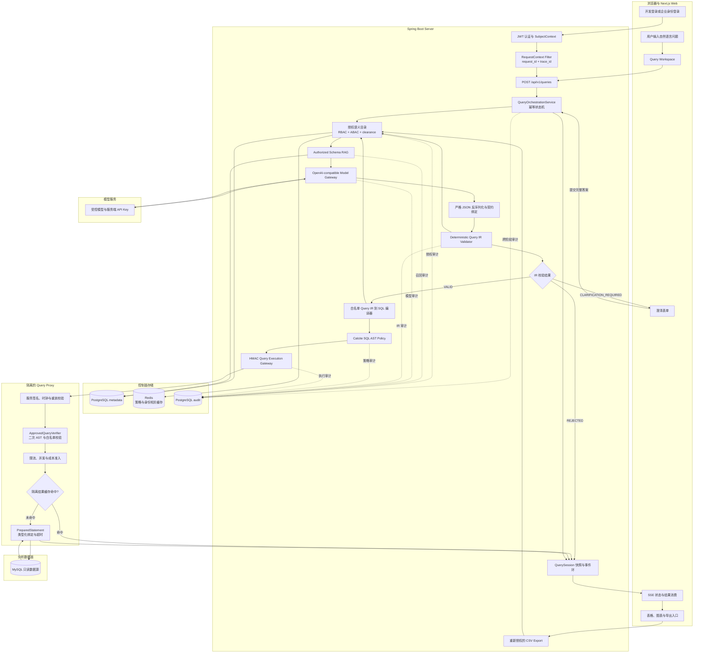
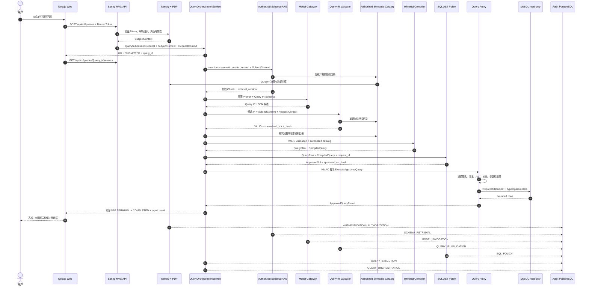
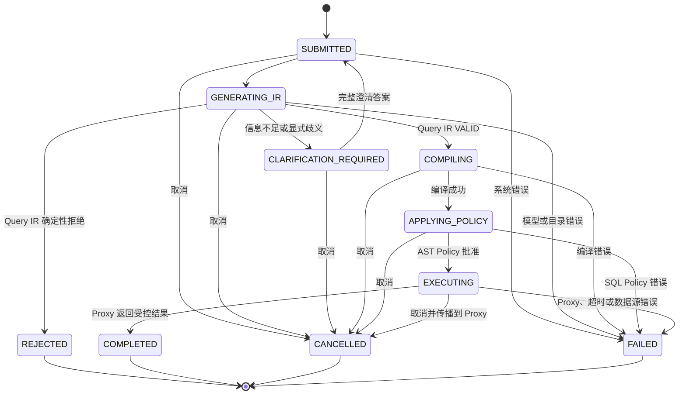
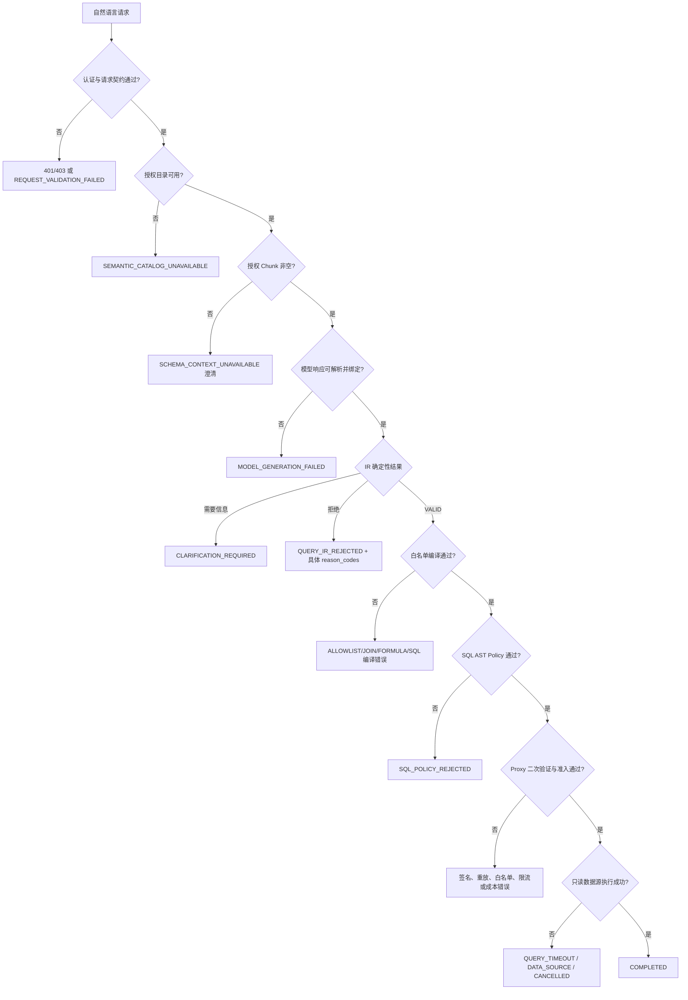
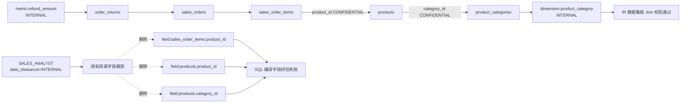

# HuaweiDB 端到端智能问数查询流程

## 1. 文档目的

本文说明 HuaweiDB 当前实现中，用户从 Web 输入自然语言问题，到系统返回受控查询结果之间的完整链路。
内容覆盖身份认证、请求上下文、授权语义目录、Schema RAG、模型调用、Query IR、确定性校验、白名单 SQL
编译、SQL AST Policy、Query Proxy、只读数据源、结果展示、SSE、审计、取消、导出和失败分支。

本文描述的是当前代码的实际行为，不把规划能力视为已实现能力。核心安全原则如下：

- 浏览器只能提交自然语言问题，不能提交 SQL、数据库凭据、角色、策略结论或执行上限。
- 模型只能生成候选 Query IR，模型输出不是执行许可。
- SQL 只能由确定性白名单编译器生成，不能由模型直接生成或补写。
- Server 不能直连分析型 MySQL，只有独立 Query Proxy 持有只读数据源凭据。
- 每个关键阶段都 fail-closed：任一校验失败都会终止链路，不回退到自由 Text-to-SQL。
- 授权、语义模型、IR、SQL AST 和执行请求通过版本与哈希绑定，避免阶段间对象替换。

## 2. 参与组件与数据边界

| 区域 | 组件 | 主要职责 | 不可信输入/边界 |
| --- | --- | --- | --- |
| 浏览器 | Next.js Web | 登录、提交问题、SSE 消费、澄清、结果展示、导出 | 用户输入、浏览器状态 |
| API/BFF | Spring MVC Controller | 接收受控契约、解析服务器身份与请求上下文 | 不接受客户端自报身份和策略 |
| 编排 | `QueryOrchestrationService` | 状态机、幂等、取消、阶段调用和结果快照 | 不生成 SQL，不绕过阶段 |
| 身份与策略 | Identity + PDP | JWT、组织属性、RBAC/ABAC、行过滤、掩码和上限 | 客户端不能覆盖 SubjectContext |
| 元数据 | PostgreSQL metadata | 语义目录、指标 AST、Join Graph、策略、Schema 快照 | 只使用已发布版本 |
| 授权 RAG | `AuthorizedSchemaRetriever` | 先授权后召回，生成受限 Schema 上下文 | 未授权资产不得进入 Prompt |
| 模型网关 | OpenAI-compatible Gateway | 生成严格结构化 Query IR 候选 | 模型响应始终不可信 |
| IR 安全边界 | `QueryIrValidator` | 三态确定性校验、规范化和 IR 哈希 | 仅 `VALID` 可进入编译 |
| 编译边界 | `QueryCompiler` | 语义资产到物理白名单 SQL AST | 不接受表名、列名或 SQL 片段 |
| SQL 策略边界 | `SqlPolicyEnforcer` | AST 复核、行列策略、时间和 LIMIT 改写 | 仅输出 `ApprovedSql` |
| 执行边界 | Query Proxy | HMAC 认证、二次 AST 验证、限流、缓存和 JDBC | 不信任 Server 自报 SQL 属性 |
| 数据源 | MySQL read-only | 执行参数化只读查询 | 账号无 DDL/DML/GRANT 权限 |
| 审计 | PostgreSQL audit | 保存跨阶段证据与关联 ID | 不保存 SQL、Prompt、凭据和结果数据 |

## 3. 完整总流程图



图中的实线是业务数据流，虚线是审计证据流。审计流不传输 SQL、模型 Prompt、API Key、Token、
数据库密码或原始结果数据。

## 4. 成功路径时序图



## 5. QuerySession 状态机



成功状态顺序固定为：

```text
SUBMITTED -> GENERATING_IR -> COMPILING -> APPLYING_POLICY -> EXECUTING -> COMPLETED
```

`REJECTED` 表示候选 Query IR 不满足确定性规则；`FAILED` 表示 IR 之后的编译、策略、执行或系统阶段失败。
前端标题不应把两者都笼统解释为“策略拒绝”。

## 6. 各阶段详细说明

### 6.1 登录、认证和请求上下文

1. 本地开发登录通过 `POST /auth/dev/login`，企业模式可经 OIDC/IAM 适配器进入同一身份契约。
2. 服务端验证凭据或 Token 后，从服务端持久化数据解析 `subject_id`、组织、角色和组织属性。
3. `SubjectContext` 由服务端创建，不能从查询请求体接收角色、区域或密级。
4. `RequestContextWebFilter` 校验或生成 `request_id`、`trace_id`，写入响应头、MDC 和追踪上下文。
5. API 错误使用版本化 `application/problem+json`，不返回内部异常和敏感配置。

本地分析员的典型受控属性为：

```text
subject_id = usr-east-analyst
organization_id = org-east-sales
roles = [SALES_ANALYST]
region = EAST
data_clearance = INTERNAL
```

### 6.2 提交、幂等和会话所有权

Web 调用：

```http
POST /api/v1/queries
Authorization: Bearer <access-token>
Content-Type: application/json

{
  "contract_version": "1.0",
  "idempotency_key": "client-generated-unique-key",
  "conversation_id": null,
  "semantic_model_version": "retail-sales-v1",
  "question": "查询2026年上半年每月销售额"
}
```

编排器立即创建 `QuerySession` 并返回 `202 SUBMITTED`。幂等键按主体隔离，并绑定请求指纹：

- 相同主体、相同键、相同请求返回已有会话；
- 相同主体、相同键、不同请求返回 `IDEMPOTENCY_CONFLICT`；
- 其他主体不能读取、取消、澄清或导出该 Query ID；
- 越权读取按 `RESOURCE_NOT_FOUND` 处理，避免形成资源枚举预言机。

当前 QuerySession、幂等绑定、SSE 订阅者和事件环保存在单个 Server 进程内存中，Server 重启后不恢复，
也不能由多个副本共享。

### 6.3 授权语义目录

`DefaultSemanticCatalogService` 从 PostgreSQL 加载已发布语义模型，然后执行：

1. 对 `domain:<domain_id>` 做 PDP `QUERY` 决策。
2. 按 `data_clearance` 裁剪数据集、指标、维度和字段。
3. 对每个指标和维度再次执行资源级 PDP 决策。
4. 过滤指标可用维度、枚举、术语和 Join Graph。
5. 合并策略数据约束：行过滤、列掩码、最大行数、最大成本、导出和分享权限。
6. 返回 `AuthorizedSemanticCatalog`，绑定 `policy_version`。

对于 `SALES_ANALYST`，本地策略还会强制注入区域过滤，并把最大结果行数限制为 `1000`。用户不能通过
自然语言、Prompt 或 Query IR 修改这些约束。

### 6.4 授权 Schema RAG

RAG 的顺序严格为“先授权、后检索”：

1. 加载授权语义目录。
2. 使用授权的 `dataset_id` 和 `field_id` 约束物理 Schema Chunk 查询。
3. 综合精确资产 ID、语义词项、token overlap 和确定性 hash embedding 进行召回。
4. 按分数和稳定资产 ID 重排，限制 Chunk 数量、字段范围和单 Chunk 长度。
5. 计算绑定语义版本、策略版本、Schema 指纹和 embedding 版本的 `retrieval_version`。
6. 只把授权 Chunk 送入模型 Prompt。

如果授权 Chunk 为空，系统不调用模型，而是返回 `SCHEMA_CONTEXT_UNAVAILABLE` 澄清。

### 6.5 模型调用和 Query IR 候选生成

模型 Provider URL、API Key、模型名和 Prompt 版本只能来自服务端 Secret 配置。客户端不能覆盖它们。
模型网关执行以下边界：

- 有界并发、获取超时、连接/读取超时和有限重试；
- `temperature=0` 和输出 token 上限；
- 使用版本化 Query IR JSON Schema；
- 中转站兼容模式可使用 `JSON_OBJECT`，但完整 Schema 必须进入系统 Prompt；
- 严格反序列化为 Java `QueryIr`；
- 校验 `query_id` 和 `semantic_model_version` 与请求绑定；
- 无论模型置信度多高，都必须进入确定性 IR 校验器。

模型不得输出 SQL、物理表名、数据库连接信息或任意 JSON 扩展字段。模型调用成功只表示获得候选 IR，
不表示查询已获批准。

### 6.6 Query IR 确定性校验

`DeterministicQueryIrValidator` 按固定顺序检查：

1. Bean Validation、契约版本、必填值、重复资产和集合上限。
2. 重新加载当前主体的授权语义目录。
3. 检查单一授权业务域和显式歧义状态。
4. 检查指标、维度、过滤字段和时间字段是否存在且已授权。
5. 检查每个指标是否声明支持全部引用维度。
6. 检查过滤操作符、值数量、数据类型和枚举值。
7. 检查时间字段、时区、起止关系和完整日历边界。
8. 检查比较、排序和 TopN 约束。
9. 通过授权 Join Graph 检查所需数据集是否连通。
10. 检查候选 `limit` 不超过 PDP `max_rows`。
11. 规范化字段顺序、值格式和时区，计算稳定 `ir_hash`。

当前时间规则较严格：

| 粒度 | 时间边界要求 |
| --- | --- |
| `DAY` | 起止日期合法即可 |
| `WEEK` | 周一开始、周日结束 |
| `MONTH` | 某月 1 日开始、该月最后一天结束 |
| `QUARTER` | 1/4/7/10 月 1 日开始，完整一个季度结束 |
| `YEAR` | 1 月 1 日开始，完整一年结束 |

校验结果只有三种：

| 状态 | 后续行为 | 典型原因 |
| --- | --- | --- |
| `VALID` | 进入白名单编译 | `IR_VALID` |
| `CLARIFICATION_REQUIRED` | 停止本轮 SSE，等待用户回答 | `TIME_RANGE_REQUIRED`、`DOMAIN_REQUIRED` |
| `REJECTED` | 会话终止，不生成 SQL | `ASSET_UNAVAILABLE`、`FILTER_TYPE_INVALID`、`LIMIT_EXCEEDS_POLICY` |

### 6.7 澄清流程


前端不能自行猜测答案或补默认值。每次澄清都重新经过授权 RAG、模型和校验；不会在旧 IR 上直接修改后执行。

### 6.8 白名单 Query IR 到 SQL 编译

编排器只向 `DeterministicQueryCompiler` 传递 `VALID QueryValidationResult` 和重新加载的授权目录。编译器：

1. 核对 IR、语义模型和策略版本一致性。
2. 展开指标公式 AST 和被引用指标闭包。
3. 收集维度、时间、过滤和策略行过滤所需字段。
4. 收集所有必需数据集。
5. 通过授权 Join Graph 选择稳定、可复现的 Join 路径。
6. 将 Join 技术字段加入编译白名单并再次核对存在性。
7. 构造 `QueryPlan`，绑定最大行数、最大成本、行过滤和列掩码。
8. 使用 Calcite `SqlNode` 构造 SQL AST；不拼接用户字符串。
9. 将筛选值生成为连续的 `SqlDynamicParam` 和类型化参数。
10. 生成 MySQL 方言 SQL，重新解析后计算稳定 SQL AST 哈希。

典型编译失败：

| 原因码 | 含义 |
| --- | --- |
| `VALIDATED_IR_REQUIRED` | 未提供 `VALID` IR |
| `VALIDATION_CONTEXT_MISMATCH` | IR、语义或策略版本不一致 |
| `ALLOWLIST_OBJECT_UNAVAILABLE` | 必需指标、字段、数据集、公式节点或 Join 字段不在授权白名单 |
| `JOIN_PATH_UNAVAILABLE` | 数据集不能通过授权 Join Graph 连接 |
| `FORMULA_INVALID` | 指标公式缺失、形状错误或循环依赖 |
| `GENERATED_SQL_INVALID` | 生成 SQL 无法被 Calcite 重新解析 |

### 6.9 SQL AST Policy

`DeterministicSqlPolicyEnforcer` 不信任刚生成的 SQL 文本，而是执行二次结构化校验和改写：

1. 解析 SQL 并核对编译 AST 哈希。
2. 只接受单个基础 `SELECT`。
3. 拒绝多语句、DML、DDL、CTE、UNION、子查询、未知对象和危险函数。
4. 核对实际表、列、函数和动态参数与 `QueryPlan` 完全一致。
5. 注入主体区域等行级过滤。
6. 注入半开区间时间过滤和明确时区换算。
7. 同步应用 SELECT/GROUP BY 列掩码。
8. 强制注入不超过策略与 IR 双重上限的 `LIMIT`。
9. 注入 `HDB_REQUEST_ID` AST Hint。
10. 序列化、重新解析、再次核对并计算批准 AST 哈希。

只有 `ApprovedSql` 能进入执行网关。任一 AST 异常返回 `SQL_POLICY_REJECTED`，不会降级执行。

### 6.10 HMAC 内部执行请求

`HttpQueryExecutionGateway` 将批准 SQL、哈希、类型化参数、主体、策略版本、语义版本和执行上限封装为
`ExecuteApprovedQuery`。它对原始序列化字节计算 HMAC-SHA256，并发送服务身份、签发时间和签名。

Query Proxy 在反序列化和执行前检查：

- HMAC 是否正确；
- 请求时间是否过期或超前；
- 签名请求是否重放；
- 服务身份、语义模型、策略版本和引擎是否允许；
- IR、编译 AST、批准 AST 哈希是否齐全；
- SQL 是否仍为单条 `SELECT`；
- Request ID Hint、表、列、函数、参数序号和 LIMIT 是否匹配；
- 查询成本、超时、最大行数和主体并发是否在本地上限内。

Proxy 不因为请求来自 Server 就信任 Server 自报的白名单信息。

### 6.11 缓存、准入和 MySQL 只读执行

Query Proxy 首先执行准入控制，再检查隔离结果缓存。缓存键至少绑定主体、业务域、语义版本、策略版本、
IR/AST 哈希、参数摘要和掩码模式，禁止跨主体或跨策略复用结果。

缓存未命中时：

1. 从引擎注册表选择已配置且允许的只读引擎。
2. 使用 Hikari 只读连接和 `PreparedStatement`。
3. 按契约类型绑定参数，不把值拼接进 SQL。
4. 设置查询超时、Socket 超时、最大行数和 UTC 会话。
5. 执行期间按 `target_request_id + query_id` 注册 Statement，以支持取消。
6. 超出最大行数、超时、数据库错误或取消都映射为稳定错误码。
7. 使用 try-with-resources 关闭 ResultSet、Statement 和 Connection。

MySQL 查询账号只能 `SELECT`；DDL、DML、GRANT 和管理操作由数据库权限再次拒绝。

### 6.12 SSE、结果展示和导出

浏览器收到 `202 SUBMITTED` 后，通过带 Authorization Header 的 `fetch + ReadableStream` 消费 SSE。
每个事件带单调递增 `sequence`；重连时使用 `Last-Event-ID`，不会重新提交自然语言问题。

成功结果包含类型化列、受限行、缓存状态、耗时和数据保护元数据。Web：

- 以 React 文本渲染单元格，不执行 HTML 或 Markdown；
- 页面最多渲染 200 行；
- 图表最多使用 12 个有限数值点；
- 不向浏览器返回 SQL；
- 展示被掩码字段和数据保护状态。

CSV 导出不是对现有按钮状态的信任。`GET /api/v1/queries/{queryId}/export` 会重新执行 `EXPORT` PDP
决策，并对以 `= + - @` 开头的单元格增加前导单引号，防止电子表格公式注入。

### 6.13 取消和断连

显式取消会中断编排 Future。如果已进入 `EXECUTING`，Server 会向 Query Proxy 发送独立 HMAC 签名取消请求，
Proxy 调用 JDBC `Statement.cancel()`。非终态 SSE 断连也会请求取消，避免无人消费的后台查询继续占用资源。

## 7. 失败分支总图



排障时必须先确定失败阶段，再解释 reason code。仅根据 Web 上的“策略拒绝”或“执行失败”标题无法准确定位。

## 8. 一条查询必须满足的完整前提

| 阶段 | 必须满足的前提 | 不满足时的结果 |
| --- | --- | --- |
| 身份 | Token 有效，主体状态有效，组织与角色可解析 | 认证失败 |
| 请求 | 契约版本、幂等键、语义版本和问题长度合法 | 请求校验失败 |
| 域授权 | PDP 允许查询目标业务域 | 资源不可用/拒绝 |
| 密级 | 主体密级覆盖目录、指标、维度、公式字段和技术依赖 | 资产被裁剪 |
| RAG | 授权资产存在且能召回受限 Chunk | 澄清，不调用模型 |
| 模型 | 返回严格 JSON，query ID 和语义版本绑定 | 模型错误 |
| IR 结构 | 指标至少一个，ID、数组和类型符合 Schema | `IR_STRUCTURE_INVALID` |
| IR 资产 | 指标、维度、过滤和时间字段均存在且已授权 | `ASSET_UNAVAILABLE` |
| IR 时间 | 时区合法，时间范围存在且符合完整粒度边界 | 澄清或 `TIME_RANGE_INVALID` |
| IR 过滤 | 操作符、参数数量、类型和枚举合法 | `FILTER_TYPE_INVALID` |
| IR 排序 | 排序字段已选择，TopN 不超过 limit | `ORDERING_INVALID` |
| IR 上限 | limit 不超过 PDP max_rows | `LIMIT_EXCEEDS_POLICY` |
| 逻辑 Join | 指标和维度的数据集在授权 Join Graph 中连通 | `JOIN_PATH_UNAVAILABLE` |
| 物理编译 | 公式、字段、数据集、Join 键和策略字段全部在编译白名单 | `ALLOWLIST_OBJECT_UNAVAILABLE` |
| AST Policy | SQL 形状、对象、函数、参数和强制策略一致 | `SQL_POLICY_REJECTED` |
| Proxy | HMAC、时间窗、重放、版本、哈希和本地白名单一致 | Proxy 拒绝 |
| 数据源 | 引擎健康、只读账号可用、未超时或超限 | 执行失败 |
| 审计 | 审计数据库可用且关键事件可持久化 | fail-closed |

## 9. 当前已确认的目录与编译不一致缺口

### 9.1 现象

分析员问题：退款额按商品分类和月份汇总。运行结果为：

```text
Query ID: qry-3bdbe777-de55-445d-9fcb-f5e3c4b03624
MODEL_INVOCATION: SUCCESS
QUERY_IR_VALIDATION: VALID / IR_VALID
QuerySession: FAILED
failure.reason_code: ALLOWLIST_OBJECT_UNAVAILABLE
```

该 Query IR 已正确包含：

```text
metric_ids = [metric:refund_amount]
dimension_ids = [dimension:order_date, dimension:product_category]
time_range = 2026-01-01 .. 2026-06-30 / MONTH / Asia/Shanghai
limit = 100
```

### 9.2 根因图



语义迁移使用 `CROSS JOIN` 把所有指标与所有维度声明为兼容，但没有按授权后的物理 Join 字段闭包验证组合。
因此逻辑层允许 `refund_amount + product_category`，编译层却无法取得技术 Join 键。

### 9.3 对照验证

| 主体与问题 | 结果 |
| --- | --- |
| `east_sales_analyst`：月度退款额，不带商品分类 | `COMPLETED` |
| `data_admin`：月度退款额，带商品分类 | `COMPLETED` |
| `east_sales_analyst`：月度退款额，带商品分类 | `ALLOWLIST_OBJECT_UNAVAILABLE` |

这证明问题不在中文、模型连通性、退款额公式、日期格式或 MySQL，而在授权字段闭包不完整。

### 9.4 建议修复方向

1. 不再用指标与维度的无条件笛卡尔积维护 `semantic_metric_dimensions`。
2. 发布语义模型时，对每个指标/维度组合预计算完整公式、数据集、Join 键和策略字段闭包。
3. 区分“允许作为用户输出字段”和“只允许编译器作为 Join/Policy 技术字段”两种能力。
4. 授权目录可为编译器保留 `JOIN_ONLY` 技术字段，但不得把它们暴露给 RAG、模型或结果。
5. IR 校验器应把行过滤和 Join 字段纳入可编译性检查，避免先返回 `IR_VALID` 后在编译阶段失败。
6. Web 应展示阶段和具体 reason code，例如“白名单编译失败：缺少授权 Join 字段”。
7. 增加按角色、指标、维度和策略约束展开的全组合编译回归测试。

## 10. 审计与可观测性

每个请求由 `request_id` 和 `trace_id` 关联，查询阶段再使用 `query_id`。关键审计类型如下：

| 审计事件 | 关键证据示例 |
| --- | --- |
| `AUTHENTICATION` | 身份 Provider、结果和稳定原因码 |
| `AUTHORIZATION` | 资源、动作、策略版本、行过滤/掩码数量 |
| `SCHEMA_RETRIEVAL` | retrieval version、Chunk 数、Schema 指纹 |
| `MODEL_INVOCATION` | Provider、模型、Prompt 版本、token、耗时、结果 |
| `QUERY_IR_VALIDATION` | 候选/规范化 IR 哈希、语义/策略版本、原因码 |
| `SQL_POLICY` | AST 哈希、应用规则、结果和原因码 |
| `QUERY_EXECUTION` | 行数、扫描量、耗时、缓存和稳定结果码 |
| `QUERY_ORCHESTRATION` | 状态、阶段耗时、终态原因和 Query ID |
| `RESULT_ACCESS` | 结果访问或审计查询行为 |
| `EXPORT` | 重新授权结果和导出行为 |

明确禁止写入审计和普通日志的内容：

```text
原始 SQL
SQL 参数值
完整 Prompt
自然语言问题原文
模型原始 payload
Access/Refresh Token
API Key
数据库凭据
原始查询结果
```

## 11. 按 Query ID 排障顺序

1. 从 Web 或 `GET /api/v1/queries/{queryId}` 获取会话终态。
2. 先区分 `REJECTED`、`FAILED`、`CLARIFICATION_REQUIRED` 和 `CANCELLED`。
3. 检查 `validation.status`、`validation.reason_codes` 和 `failure.reason_code`。
4. 用 Query ID 查询授权审计，按时间顺序查看模型、IR、策略、执行和编排事件。
5. 若模型失败，检查 Provider 健康、超时、结构化响应和版本绑定。
6. 若 IR 拒绝，检查指标/维度 ID、时间边界、过滤类型、Join Graph 和 limit。
7. 若编译失败，检查公式闭包、授权字段、策略行过滤字段和 Join 技术字段。
8. 若 AST Policy 拒绝，检查实际表/列/函数/参数和强制策略改写。
9. 若 Proxy 拒绝，检查 HMAC 时间窗、重放、部署白名单、策略版本和引擎配置。
10. 若数据库执行失败，检查只读账号、MySQL 健康、超时、最大行数和取消记录。
11. 不通过放宽 SQL 安全策略、跳过 IR 校验或让 Server 直连 MySQL 来“临时恢复”。

## 12. 关键代码与契约索引

| 环节 | 主要实现或契约 |
| --- | --- |
| API 安全 | `apps/server/src/main/java/com/huaweidb/api/security/ApiSecurityConfiguration.java` |
| 请求上下文 | `apps/server/src/main/java/com/huaweidb/requestcontext/RequestContextWebFilter.java` |
| 查询 API | `apps/server/src/main/java/com/huaweidb/api/query/QueryOrchestrationController.java` |
| 查询编排 | `apps/server/src/main/java/com/huaweidb/orchestration/internal/DefaultQueryOrchestrationService.java` |
| 授权语义目录 | `apps/server/src/main/java/com/huaweidb/semantic/internal/DefaultSemanticCatalogService.java` |
| 授权 RAG | `apps/server/src/main/java/com/huaweidb/schema/internal/DefaultAuthorizedSchemaRetriever.java` |
| 模型网关 | `apps/server/src/main/java/com/huaweidb/integration/model/OpenAiCompatibleModelGateway.java` |
| IR 生成 | `apps/server/src/main/java/com/huaweidb/model/internal/DefaultQueryIrGenerationService.java` |
| IR 校验 | `apps/server/src/main/java/com/huaweidb/queryir/internal/DeterministicQueryIrValidator.java` |
| Query IR Schema | `contracts/jsonschema/query-ir.v1.schema.json` |
| 白名单编译 | `apps/server/src/main/java/com/huaweidb/querycompiler/internal/DeterministicQueryCompiler.java` |
| SQL AST Policy | `apps/server/src/main/java/com/huaweidb/sqlpolicy/internal/DeterministicSqlPolicyEnforcer.java` |
| 执行网关 | `apps/server/src/main/java/com/huaweidb/queryexecution/internal/HttpQueryExecutionGateway.java` |
| Proxy API | `apps/query-proxy/src/main/java/com/huaweidb/queryproxy/api/ApprovedQueryController.java` |
| Proxy 二次验证 | `apps/query-proxy/src/main/java/com/huaweidb/queryproxy/verification/ApprovedQueryVerifier.java` |
| Proxy 执行 | `apps/query-proxy/src/main/java/com/huaweidb/queryproxy/execution/ApprovedQueryExecutor.java` |
| Proxy 缓存 | `apps/query-proxy/src/main/java/com/huaweidb/queryproxy/execution/QueryResultCache.java` |
| Web 工作台 | `apps/web/src/components/query-workspace.tsx` |
| Web SSE | `apps/web/src/lib/sse.ts` |
| 查询会话契约 | `contracts/jsonschema/query-session.v1.schema.json` |
| Proxy 内部契约 | `contracts/openapi/huaweidb-query-proxy-internal.v1.yaml` |
| 审计存储 | `apps/server/src/main/java/com/huaweidb/audit/internal/JdbcAuditRecorder.java` |

## 13. 流程 Review 清单

对查询链路做代码或架构 Review 时，至少确认：

- 身份、角色、区域和密级全部来自服务端可信上下文。
- 未授权资产在 RAG 召回之前已经排除。
- 模型响应不能携带 SQL，也没有直接执行路径。
- Query IR 结构、资产、时间、过滤、Join 和 limit 均 fail-closed。
- 指标/维度兼容性覆盖实际公式、Join 键和策略字段闭包。
- 编译器只使用版本化语义白名单和 Calcite AST。
- 所有用户值使用类型化动态参数。
- SQL AST Policy 在批准前后都重新解析和核对。
- Query Proxy 独立重验签名、AST、对象、参数、版本和上限。
- Server 不持有分析型数据源凭据和 JDBC Driver。
- 数据库账号通过真实授权验证为只读。
- 缓存键隔离主体、域、策略、语义、IR、AST、参数和掩码。
- 取消能传播到运行中的 JDBC Statement。
- 导出重新授权并防护 CSV 公式注入。
- 审计完整但不记录 SQL、Prompt、Secret、参数值和原始结果。
- 每个失败阶段有稳定、可操作且不会泄露敏感信息的原因码。

## 14. 当前能力边界

- Query IR v1 支持登记指标、维度、过滤、完整时间范围、排序、TopN 和两类期间比较。
- Query IR v1 没有通用派生结果表达式，不能可靠表达任意“变化额、增长率、占比”等计算字段。
- 模型生成仍有随机性；`temperature=0` 不等于 Provider 输出绝对确定。
- 校验器目前没有完成授权技术 Join 字段和策略字段的完整编译前闭包检查。
- QuerySession 和 SSE 事件环尚未持久化，不适合多副本无状态部署。
- 当前本地 RAG 使用确定性 hash embedding；替换企业向量库时仍必须保持先授权后检索。
- 当前 Web 的错误文案没有完整区分 IR 拒绝、编译失败、AST 拒绝和执行失败。
