# 华为内部 AI 智能问数项目三大关键问题的业界成熟解决方案

> **文档用途**：项目架构设计、技术评审、给 Codex 说明实现思路  
> **研究重点**：语义分析、巨量数仓下的准确查询、代理查询  
> **调研日期**：2026-08-04  
> **建议技术方向**：Java 21、Spring Boot 3、本地 Qwen、Trino、企业数据仓库

---

## 1. 先说结论

智能问数并不是简单地把用户问题发给大模型，再让模型写一条 SQL。

真正成熟的智能问数系统，通常由下面几部分共同完成：

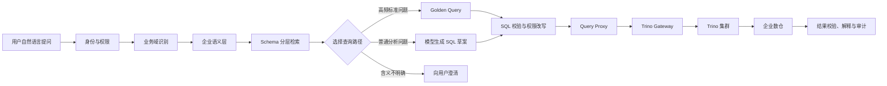

三个关键问题对应的成熟解决方法如下：

| 项目关键问题 | 业内成熟处理方式 |
|---|---|
| 怎么理解用户问题 | 企业语义层、业务词典、指标维度定义、Schema Linking、示例 SQL |
| 数仓太大、模型上下文放不下怎么办 | 业务域拆分、Schema 分层检索、混合召回、Rerank、Join 关系图、上下文压缩 |
| 怎么提高 SQL 和结果准确度 | Golden Query、语义指标、受限 Text-to-SQL、AST 校验、EXPLAIN、执行反馈、Benchmark |
| 怎么安全查询数据库 | 自研 Query Proxy + Trino Gateway + Trino + OPA/Ranger |
| 怎么防止模型越权 | 模型无数据库账号、权限过滤后再检索、程序注入行列权限、Trino 二次鉴权 |
| 怎么持续改进 | 查询日志、错误归因、人工验证 SQL、反馈闭环、回归测试集 |

最重要的一点是：

> **智能问数的准确度不能只靠模型，而要靠语义治理、检索、模型、SQL 校验、数据质量和评测体系共同保证。**

---

# 2. 关键问题一：如何做好语义分析

## 2.1 什么是语义分析

用户说的是业务语言：

```text
“查询今年华南手机业务的收入。”
```

数据库里可能只有：

```text
表：ads_sales_summary
字段：amt、region_cd、product_line_cd、stat_dt
```

语义分析要完成的事情是：

```text
“收入”       → 指标 total_revenue → SUM(amt)
“华南”       → region_cd = 'CN-SOUTH'
“手机业务”   → product_line_cd = 'PHONE'
“今年”       → stat_dt 在本自然年范围内
```

也就是说，语义分析负责把“人话”翻译成“数据库能理解的业务对象”。

---

## 2.2 业内成熟方法一：建立企业语义层

Snowflake Semantic Views、Databricks Genie Agents、dbt Semantic Layer 和 SuperSonic 都采用了类似思路：

> 在物理表和字段上面，再建立一层统一的业务定义。

语义层通常包含：

| 语义资产 | 示例 |
|---|---|
| 业务域 | 销售、财务、供应链、研发 |
| 指标 | 销售额、收入、订单量、毛利率 |
| 指标公式 | `SUM(pay_amount)` |
| 维度 | 区域、产品线、时间、渠道 |
| 业务术语 | 华南大区、终端业务、有效订单 |
| 同义词 | 收入、营收、销售收入 |
| 枚举映射 | 华南 → `CN-SOUTH` |
| 时间口径 | 自然年、财务年、滚动 12 个月 |
| Join 关系 | 订单表通过 `product_id` 关联产品表 |
| 默认过滤 | 排除取消订单、测试数据 |
| 敏感等级 | 普通、内部、机密、个人敏感信息 |
| 数据负责人 | 指标或数据集的维护团队 |
| 数据版本 | 语义定义版本、更新时间 |

简单理解：

```text
物理数据层：
ads_sales_summary.amt

企业语义层：
指标名称：销售收入
业务含义：有效订单的含税成交金额
计算公式：SUM(amt)
默认条件：order_status = 'VALID'
允许维度：区域、产品线、时间
```

Snowflake 官方将 Semantic View 定义为物理数据之上的业务抽象，可以定义逻辑表、关系、事实、维度和指标，并用规则化定义帮助 AI 提高查询准确度。

### 对本项目的落地建议

建议建立独立的 `semantic-context-service`，统一管理：

```text
业务域
指标
维度
业务术语
同义词
枚举值
时间口径
Join 关系
默认过滤
Golden Query
敏感等级
数据质量
语义版本
```

模型生成 SQL 时，不应直接根据原始 DDL 猜测，而应优先使用语义层提供的逻辑定义。

### 业内来源

- [Snowflake：Overview of semantic views](https://docs.snowflake.com/en/user-guide/views-semantic/overview)
- [Snowflake：How Snowflake validates semantic views](https://docs.snowflake.com/en/user-guide/views-semantic/validation-rules)
- [Databricks：Genie Agents concepts](https://docs.databricks.com/aws/en/genie-agents/concepts)
- [SuperSonic Wiki](https://github.com/tencentmusic/supersonic/wiki)

---

## 2.3 业内成熟方法二：业务域路由

企业数仓通常包含大量业务：

```text
销售
财务
供应链
研发
人力
项目运营
质量管理
```

成熟系统不会让一次问数在所有业务数据中乱找，而是先判断问题属于哪个业务域。

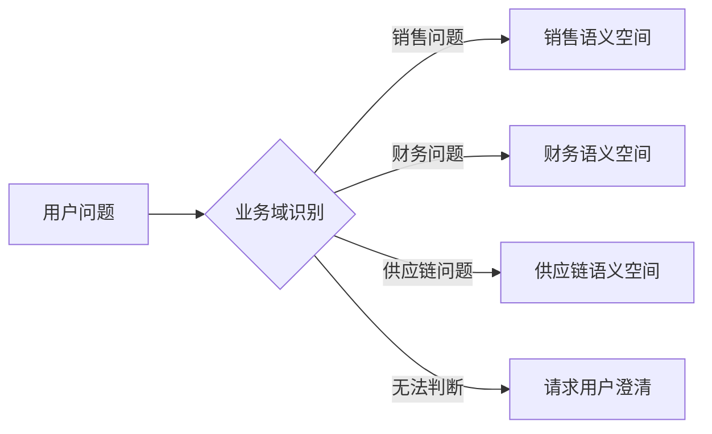

例如：

```text
用户问题：
“查询各区域今年的回款情况。”

业务域判断：
财务 / 销售回款

后续只检索：
回款相关指标、表、字段和示例 SQL
```

这样做有三个好处：

1. 缩小检索范围；
2. 减少同名表和同名字段干扰；
3. 可以在检索之前先做业务域权限判断。

Databricks Genie Agents 本身就是面向特定业务领域配置的数据问答环境。数据团队为一个 Agent 配置可信数据集、示例查询和业务规则，而不是让单个 Agent 覆盖整个企业数仓。

### 业内来源

- [Databricks：Genie Agents](https://docs.databricks.com/aws/en/genie-agents/)
- [Databricks：Genie Agents concepts](https://docs.databricks.com/aws/en/genie-agents/concepts)

---

## 2.4 业内成熟方法三：Schema Linking

Schema Linking 的含义是：

> 把用户问题里的业务词语，关联到正确的数据库、表、字段、指标和 Join 关系。

例如：

```text
用户问题：
“查询今年华南各产品线的销售额。”
```

Schema Linking 的结果可能是：

```json
{
  "domain": "sales",
  "dataset": "sales_ads",
  "tables": [
    "ads_sales_summary"
  ],
  "columns": [
    "stat_date",
    "region_code",
    "product_line",
    "sales_amount"
  ],
  "metrics": [
    "total_sales_amount"
  ],
  "values": {
    "华南": "CN-SOUTH"
  }
}
```

Schema Linking 是 Text-to-SQL 的关键前置步骤。表和字段找错了，后面的模型再聪明，也只是在认真生成错误 SQL。

研究界对大型数据库的实践通常把问题拆成：

1. 先选择目标数据库或数据集；
2. 再选择候选表；
3. 再选择相关字段；
4. 最后补齐 Join 路径。

LinkAlign 将大规模多数据库 Text-to-SQL 拆成“数据库检索”和“Schema 元素定位”两个主要问题。另一项 2026 年研究则采用“表优先”和“字段优先”两条检索路径相互补充，以提高召回率并减少无关 Schema。

### 研究来源

- [LinkAlign：Scalable Schema Linking for Real-World Large-Scale Multi-Database Text-to-SQL](https://aclanthology.org/2025.emnlp-main.51/)
- [Rethinking Schema Linking：A Context-Aware Bidirectional Retrieval Approach](https://aclanthology.org/2026.findings-eacl.236/)
- [SchemaGraphSQL：Efficient Schema Linking with Pathfinding Graph Algorithms](https://aclanthology.org/2026.findings-eacl.134/)

> 这些论文属于研究方案，不等同于已经可以原样部署的企业产品，但其问题拆分方法非常适合参考。

---

## 2.5 业内成熟方法四：混合检索

只使用向量检索并不可靠。

原因是：

- 字段名可能非常短，例如 `amt`、`cd`、`dt`；
- 不同业务域里可能都有“收入”；
- 用户提到的是字段值，不一定是字段名；
- 相似度高不代表 Join 关系正确；
- 同名字段可能有不同业务口径。

推荐组合：

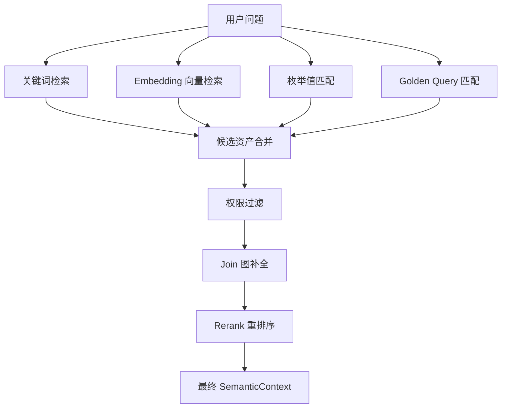

各方法的作用：

| 方法 | 主要解决什么 |
|---|---|
| 关键词检索 | 精确匹配表名、字段名、业务术语 |
| 向量检索 | 匹配近义表达和自然语言描述 |
| 枚举值匹配 | 把“华南”“手机业务”定位到具体字段和值 |
| Golden Query | 召回历史验证过的标准问题和 SQL |
| 权限过滤 | 删除用户无权看到的元数据 |
| Join 图 | 补充查询需要的关联表 |
| Rerank | 对候选表、字段和示例重新排序 |

Databricks Genie Agents 的知识库包括表列描述、同义词、Join 关系、SQL 表达式和匹配规则。这说明成熟方案不是只做一次向量检索，而是把结构化业务知识一起用于问题理解。

### 业内来源

- [Databricks：Genie Agents concepts](https://docs.databricks.com/aws/en/genie-agents/concepts)
- [SuperSonic Wiki](https://github.com/tencentmusic/supersonic/wiki)

---

# 3. 关键问题二：面对巨量数仓和有限模型上下文，怎么保证准确度

## 3.1 最大误区：把整个数仓 Schema 塞给模型

假设企业数仓有：

```text
100 个数据库
5 万张表
80 万个字段
大量视图、指标和字段枚举
```

即使模型上下文窗口很大，也不应该全部塞入 Prompt。

原因包括：

- Token 数量可能超限；
- 无关表和字段会干扰模型；
- 大量相似表会增加选错概率；
- 未授权元数据可能被暴露；
- Prompt 成本和响应时间变高；
- 模型可能幻觉出不存在的字段；
- 上下文越长，不代表模型越能抓住关键内容。

成熟方案普遍采用：

> **先检索相关 Schema，再把小范围上下文交给模型。**

CHESS 研究将大型 Schema 先进行筛选，再交给 SQL 生成模块；论文报告中，该方法在其评测设置下将 Token 使用量减少约 5 倍，并提高了大型数据库场景的表现。

### 研究来源

- [CHESS：Contextual Harnessing for Efficient SQL Synthesis](https://arxiv.org/abs/2405.16755)

---

## 3.2 成熟方法一：Schema 分层检索

推荐把检索拆成五层：

```text
第一层：业务域
第二层：数据集、Catalog 或 Schema
第三层：表或语义模型
第四层：字段、指标、维度和枚举
第五层：Join 路径
```

完整流程：

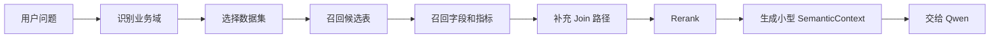

例如原数仓有 5 万张表，分层后模型最终可能只看到：

```text
2 张候选表
15 个字段
3 个指标定义
2 条 Join 关系
4 条示例 SQL
```

这就是“先缩小范围，再让模型推理”。

---

## 3.3 Schema 分层的具体实现

### 第一层：业务域

```text
销售、财务、供应链、研发
```

实现方式：

- 小模型分类；
- 规则关键词；
- Embedding 分类；
- 用户允许业务域过滤；
- 多轮上下文辅助。

### 第二层：数据集

例如：

```text
sales_ads
finance_dws
supply_chain_dm
```

可根据数据集描述、所属部门、标签和历史查询进行召回。

### 第三层：表

表级索引建议包含：

```text
表名
中文名称
业务描述
所属主题
常用问题
字段摘要
上游和下游
数据更新时间
敏感等级
```

### 第四层：字段和语义对象

字段级索引建议包含：

```text
字段名
中文含义
类型
别名
典型值
所属指标
所属维度
是否敏感
```

### 第五层：Join 图

系统维护一张关系图：

```text
订单事实表 --product_id--> 产品维表
订单事实表 --region_id--> 区域维表
订单事实表 --customer_id--> 客户维表
```

模型或程序确定起点表和目标表后，通过图搜索找到经过验证的 Join 路径。

SchemaGraphSQL 的研究方案就是先建立 Schema 图，再使用路径搜索确定需要的表和 Join 顺序。

### 研究来源

- [SchemaGraphSQL](https://aclanthology.org/2026.findings-eacl.134/)
- [LinkAlign](https://aclanthology.org/2025.emnlp-main.51/)

---

## 3.4 成熟方法二：离线建设索引，在线只做小范围召回

不要在用户每次提问时临时扫描全部元数据。

推荐分成离线和在线两部分：

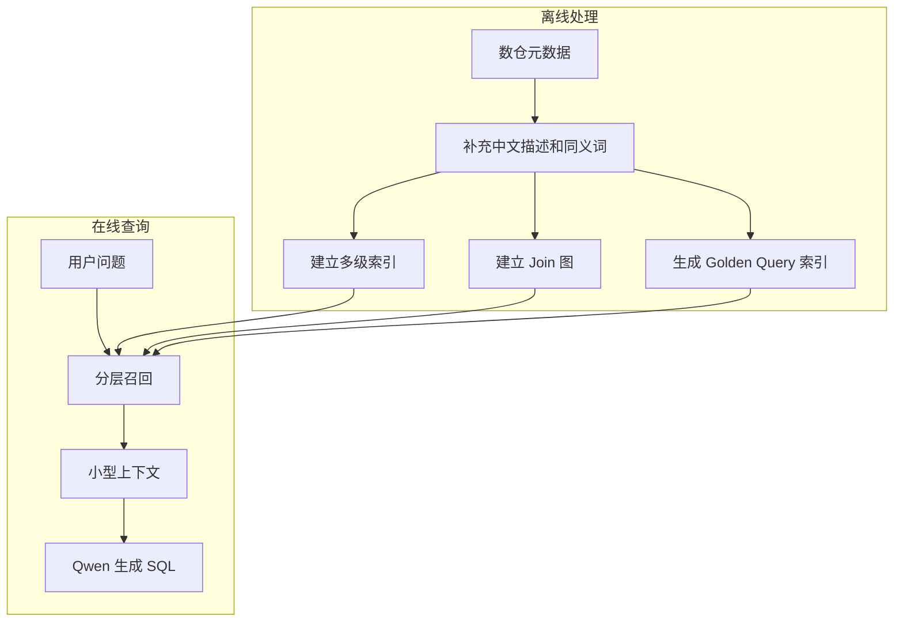

离线阶段应补充：

- 中文业务说明；
- 术语和同义词；
- 典型字段值；
- 指标与维度；
- 常用过滤条件；
- Join 基数；
- 历史正确 SQL；
- 表和字段血缘；
- 数据敏感等级；
- 数据质量状态。

原始 DDL 只是技术信息，真正能帮助模型的是业务语义。

---

## 3.5 成熟方法三：不同问题走不同查询路径

所有问题都让模型自由写 SQL，会导致高频问题也重复冒险。

成熟系统通常建立可信度分层：

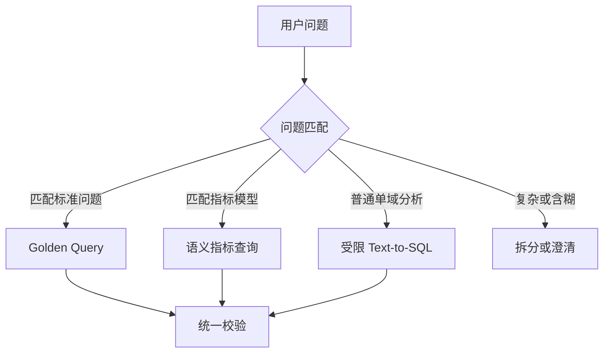

推荐优先级：

| 优先级 | 查询路径 | 适用场景 |
|---|---|---|
| 1 | Golden Query | 核心、高频、口径固定的问题 |
| 2 | 语义指标查询 | 指标与维度组合明确的问题 |
| 3 | Qwen 生成受限 SQL | 普通单业务域分析 |
| 4 | 多步拆分 | 复杂归因、深层 Join |
| 5 | 澄清或拒绝 | 含义不明确、权限不足、Schema 不足 |

Snowflake 的 Verified Query Repository 会保存经过验证的问题和 SQL，在遇到相似问题时利用这些已验证查询，提高结果的准确性和可信度。

### 业内来源

- [Snowflake：Cortex Analyst Verified Query Repository](https://docs.snowflake.com/en/user-guide/snowflake-cortex/cortex-analyst/verified-query-repository)
- [Snowflake：Optimize semantic models with verified queries](https://docs.snowflake.com/en/user-guide/snowflake-cortex/cortex-analyst/analyst-optimization)
- [Snowflake：Suggestions for semantic models and views](https://docs.snowflake.com/en/user-guide/snowflake-cortex/cortex-analyst/verified-query-suggestions)

---

## 3.6 成熟方法四：模型分工，而不是一个模型负责全部步骤

推荐模型和程序的分工如下：

| 组件 | 负责内容 |
|---|---|
| 规则或小模型 | 业务域分类、关键词提取、是否需要澄清 |
| Embedding 模型 | 召回表、字段、指标和示例 SQL |
| Rerank 模型 | 对候选结果重新排序 |
| Qwen 主模型 | 理解复杂问题、生成 SQL 草案 |
| Java 程序 | 权限校验、SQL AST、改写、执行与审计 |
| Trino | 分布式执行 SQL |

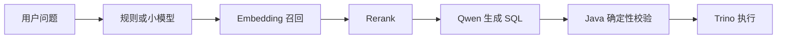

好处是：

- 降低主模型上下文；
- 减少推理成本；
- 提高响应速度；
- 每个步骤可以单独评测；
- 安全规则不依赖大模型。

Databricks 明确将 Genie Agents 描述为复合 AI 系统，而不是单次调用一个大模型完成全部工作。

### 业内来源

- [Databricks：Genie Agents concepts](https://docs.databricks.com/aws/en/genie-agents/concepts)

---

## 3.7 成熟方法五：SQL 生成后必须自动验证

不能使用：

```text
Qwen 生成 SQL → 直接查询数据库
```

推荐：

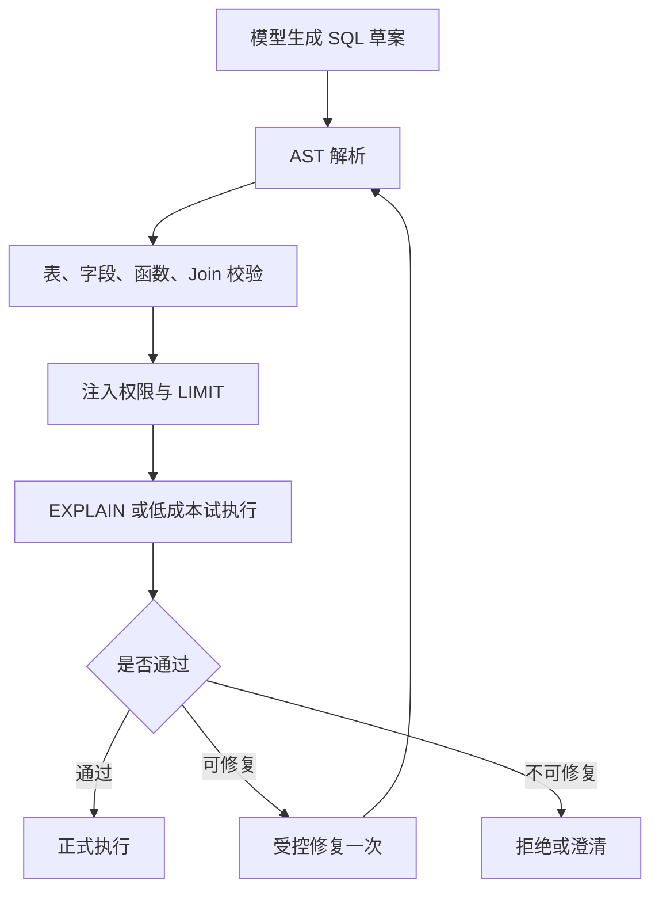

至少检查：

- 语句是不是只读查询；
- 是否只有一条 SQL；
- 表和字段是否在白名单；
- Join 路径是否经过验证；
- 是否存在笛卡尔积；
- 是否使用了正确指标；
- 是否缺少时间过滤；
- 是否访问敏感字段；
- 是否包含过大的扫描范围；
- 是否需要强制 LIMIT；
- 执行计划是否异常；
- 结果粒度是否符合问题。

CHESS 将大型 Text-to-SQL 拆成信息检索、Schema 选择、候选生成和测试验证等模块。这种“生成后验证”的思路比单次生成可靠得多。

### 研究来源

- [CHESS：Contextual Harnessing for Efficient SQL Synthesis](https://arxiv.org/abs/2405.16755)

---

## 3.8 成熟方法六：复杂问题拆分

问题越复杂、跨越的 Join 越多，模型越容易选错关联关系。

例如：

```text
“分析各区域收入下降是否与供应商交付延迟和研发版本缺陷有关。”
```

这可能同时涉及：

- 销售；
- 供应链；
- 研发质量；
- 时间对齐；
- 多个事实表。

不建议一次生成一条超长 SQL。

可拆成：

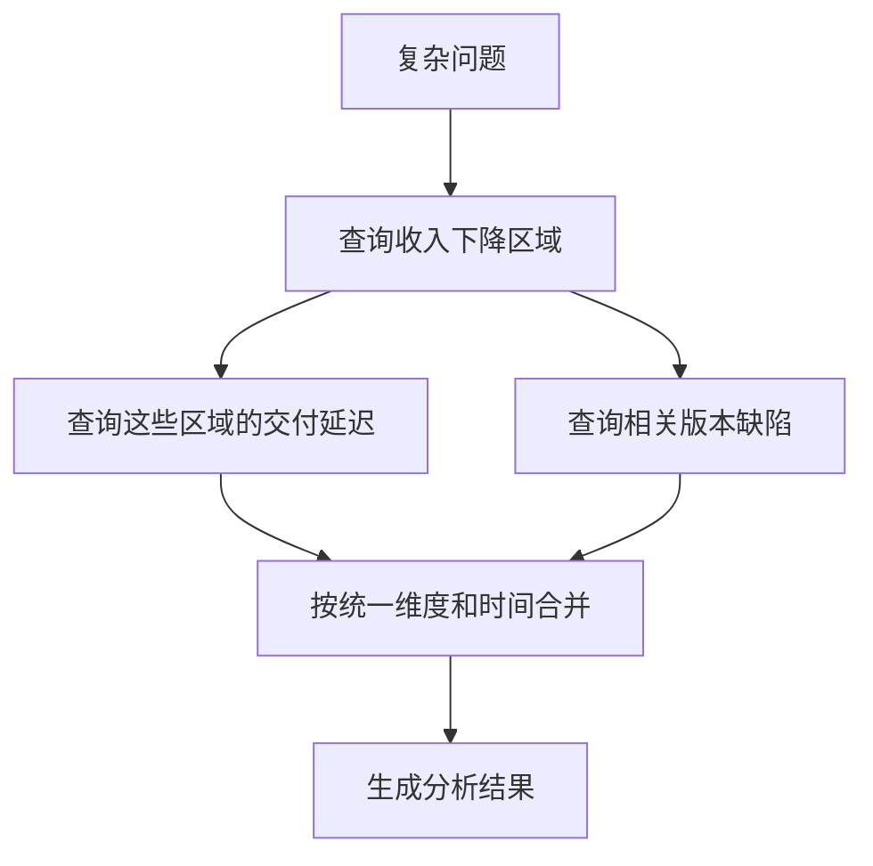

首期项目应优先限制为单业务域、明确指标和较浅 Join。跨域归因可以放到后续阶段，毕竟系统第一天就试图理解整个企业，往往会先理解到预算不够。

---

## 3.9 成熟方法七：低置信度时主动澄清

用户说：

```text
“查询今年收入。”
```

系统无法确定：

- 是销售收入、财务确认收入还是回款；
- 是自然年还是财务年；
- 是全公司还是某个业务域。

正确行为不是猜，而是询问：

```text
请确认：
1. 查询销售收入、财务确认收入还是回款金额？
2. “今年”按自然年还是财务年度？
3. 查询范围是全公司还是当前业务部门？
```

Snowflake Cortex Analyst 的接口在无法生成明确 SQL 时，可以返回建议问题；Databricks Genie Agents 也可以在无法回答时提出澄清问题。

### 业内来源

- [Snowflake：Cortex Analyst REST API](https://docs.snowflake.com/en/user-guide/snowflake-cortex/cortex-analyst/rest-api)
- [Databricks：Genie Agents concepts](https://docs.databricks.com/aws/en/genie-agents/concepts)

---

# 4. 关键问题三：如何代理查询

## 4.1 为什么不能让模型直接连接数据库

不能设计成：

```text
用户 → Qwen → 数据库
```

原因包括：

- 模型可能生成危险 SQL；
- 模型可能访问未授权数据；
- 无法可靠实施行列权限；
- 无法统一控制超时、并发和扫描量；
- 数据库凭据可能暴露；
- 无法稳定审计；
- 难以取消和追踪查询；
- 多数据源接入会越来越混乱。

推荐：

```text
模型只生成 SQL 草案
程序决定 SQL 能不能执行
Query Proxy 是唯一业务执行入口
Trino 负责真正查询
```

---

## 4.2 业内成熟的三层代理结构

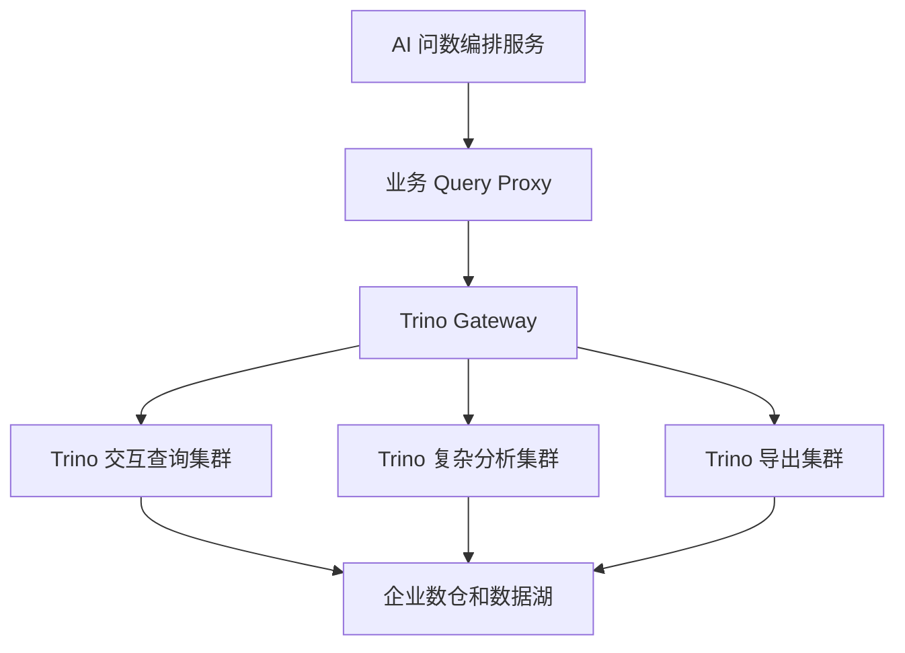

三层职责：

| 层级 | 组件 | 主要职责 |
|---|---|---|
| 业务控制层 | 自研 Query Proxy | 权限、SQL 校验、限流、超时、缓存、审计 |
| 集群路由层 | Trino Gateway | 选择健康集群、负载均衡、查询粘滞 |
| 数据执行层 | Trino | SQL 优化、分布式执行、Connector 访问数据源 |

---

## 4.3 第一层：自研 Query Proxy

Query Proxy 建议使用 Java 和 Spring Boot 实现。

主要职责：

```text
验证 SecurityContext
检查服务身份与签名
SQL AST 安全校验
表、列和指标权限
注入行级过滤条件
强制 LIMIT 和时间范围
单用户并发限制
业务域查询配额
查询队列与超时
查询取消
缓存隔离
结果大小限制
查询状态管理
全链路审计
```

Query Proxy 不负责：

- 理解自然语言；
- 调用 Qwen 生成 SQL；
- 自己实现分布式 SQL 计算；
- 决定指标业务口径。

推荐接口：

```text
POST   /internal/v1/queries
GET    /internal/v1/queries/{queryId}
GET    /internal/v1/queries/{queryId}/results
DELETE /internal/v1/queries/{queryId}
```

状态：

```text
RECEIVED
VALIDATING
AUTHORIZED
QUEUED
RUNNING
FINISHED
FAILED
REJECTED
CANCELED
TIMEOUT
```

---

## 4.4 第二层：Trino Gateway

Trino Gateway 是多个 Trino 集群前面的负载均衡、代理和路由网关。

它主要做：

- 提供统一连接地址；
- 根据 Routing Group 选择集群；
- 只把新查询路由到健康集群；
- 按运行查询数或队列长度选择较空闲集群；
- 记录 Query ID 和后端集群的对应关系；
- 后续取结果和取消查询继续回到原集群；
- 支持集群上下线和蓝绿升级。

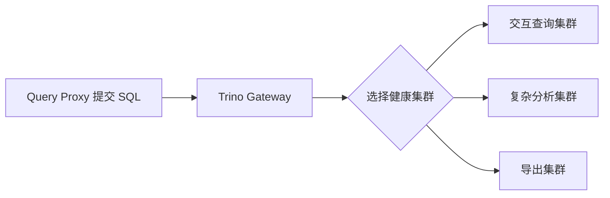

Trino Gateway 不负责：

- 业务指标口径；
- W3 权限；
- SQL AST 安全；
- 行列权限注入；
- 结果脱敏；
- AI Prompt 安全。

Trino Gateway 官方把自身定义为多个 Trino 集群前的负载均衡器、代理服务器和可配置路由网关。它会对新请求选择 Routing Group 和健康集群，并通过 Query ID 让后续请求继续回到原集群。

### 业内来源

- [Trino Gateway：Overview](https://trinodb.github.io/trino-gateway/)
- [Trino Gateway：Routing logic](https://trinodb.github.io/trino-gateway/routing-logic/)
- [Trino Gateway：Routing rules](https://trinodb.github.io/trino-gateway/routing-rules/)
- [Trino Gateway：Routers](https://trinodb.github.io/trino-gateway/routers/)

---

## 4.5 第三层：Trino 执行集群

Trino 集群通常包含：

```text
1 个 Coordinator
多个 Worker
```

Coordinator 负责：

- 接收 SQL；
- 解析和验证 SQL；
- 生成执行计划；
- 把任务拆给 Worker；
- 管理查询状态。

Worker 负责：

- 读取数据；
- 过滤；
- Join；
- 聚合；
- 排序；
- 窗口计算。

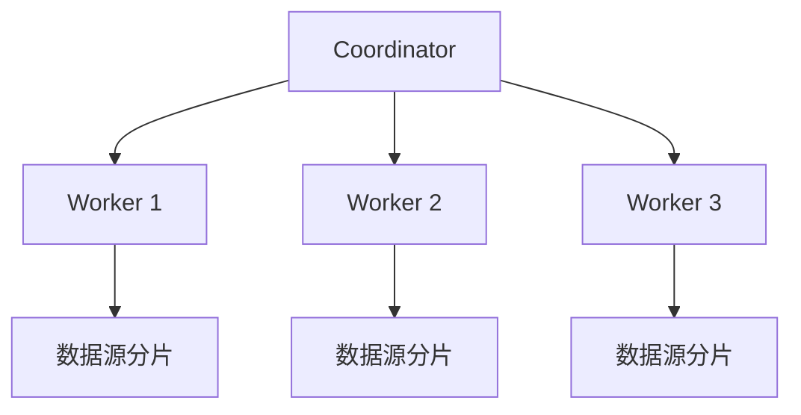

Trino 通过 Connector 访问 Hive、Iceberg、MySQL、PostgreSQL 等数据源。

---

## 4.6 Trino 查询结果如何经过代理返回

Trino 的客户端协议基于 HTTP。

基本过程：

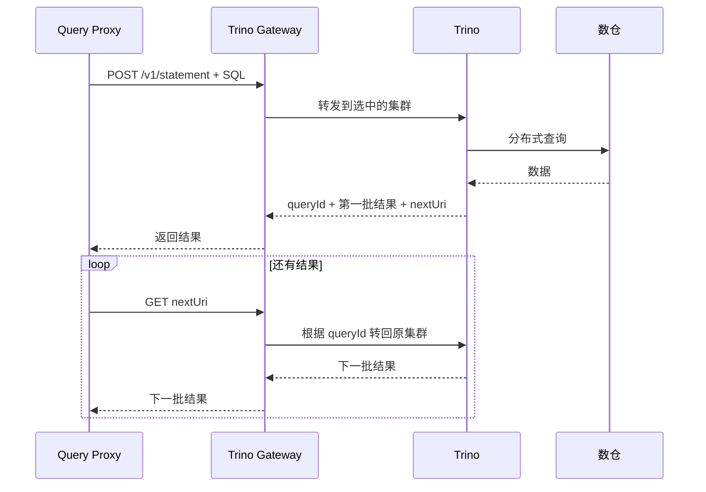

Gateway 会记住：

```text
queryId → 原来的 Trino 集群
```

这叫查询粘滞。

### 业内来源

- [Trino：Client protocol](https://trino.io/docs/current/client/client-protocol.html)
- [Trino Gateway：Routing logic](https://trinodb.github.io/trino-gateway/routing-logic/)

---

## 4.7 资源控制

查询代理不能只控制“能不能查”，还要控制“能用多少资源”。

### Query Proxy 控制业务限制

```text
单用户并发
单业务域并发
最大结果行数
请求频率
查询超时
导出次数
缓存范围
```

### Trino Resource Groups 控制计算资源

```text
运行查询数
排队查询数
CPU 时间
内存使用
队列策略
工作负载优先级
```

可划分：

```text
interactive
golden-query
adhoc
complex-analysis
export
benchmark
```

Trino Resource Groups 可以限制资源使用，并在资源不足时让新查询进入队列，而不是让所有请求一起冲进去把集群压成一块昂贵的暖气片。

### 业内来源

- [Trino：Resource groups](https://trino.io/docs/current/admin/resource-groups.html)

---

## 4.8 数据层二次鉴权

即使 Query Proxy 已经做过权限校验，Trino 层也应再次鉴权。

推荐使用：

- OPA；
- Apache Ranger；
- Trino File-based Access Control；
- 企业自定义 SystemAccessControl。

OPA 可以根据用户、用户组、操作和数据资源进行授权，并支持：

- Catalog 权限；
- Schema 权限；
- 表权限；
- 列权限；
- 行级过滤；
- 列级掩码。

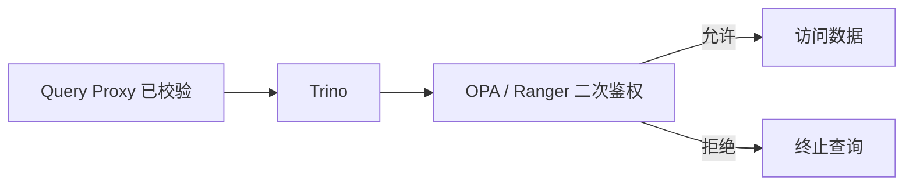

这意味着即使 Query Proxy 存在漏洞，执行层仍有最后一道防线。

### 业内来源

- [Trino：Open Policy Agent access control](https://trino.io/docs/current/security/opa-access-control.html)
- [Trino：Built-in system access control](https://trino.io/docs/current/security/built-in-system-access-control.html)

---

## 4.9 审计

建议统一使用三个编号串联全链路：

```text
request_id
proxy_query_id
trino_query_id
```

记录内容：

- W3 员工 ID；
- 用户问题；
- 业务域；
- 使用的语义资产；
- 模型版本和 Prompt 版本；
- 原始 SQL；
- 改写后 SQL；
- SQL Hash；
- 权限决策；
- 访问表和字段；
- Trino 集群；
- 扫描数据量；
- 返回行数；
- 查询耗时；
- 缓存命中；
- 查询状态；
- 错误原因。

Trino Event Listener 可以在查询创建和完成时输出会话、执行状态、资源使用和时间线信息，适合接入企业审计平台。

### 业内来源

- [Trino：Event listener](https://trino.io/docs/current/develop/event-listener.html)

---

# 5. 适合本项目的最终架构

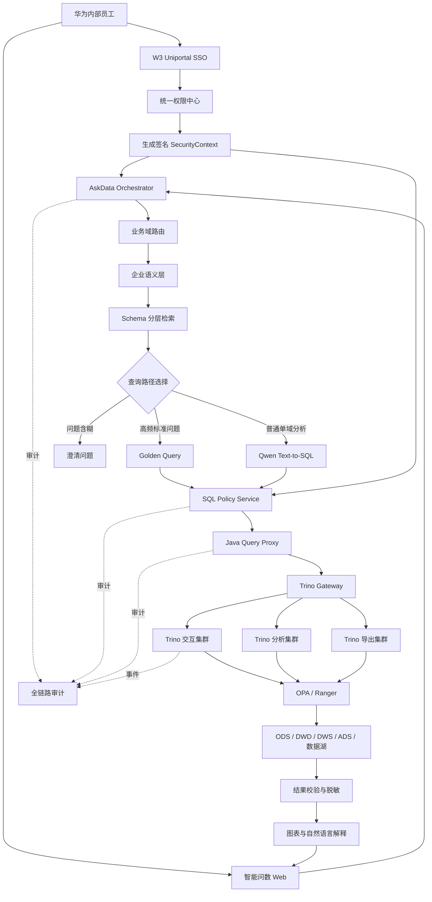

---

# 6. 推荐的服务划分

```text
AIDataSmartRequest/
├── access-session-service
├── authorization-service
├── semantic-context-service
│   ├── domain-router
│   ├── glossary
│   ├── metric-store
│   ├── schema-index
│   ├── value-index
│   ├── join-graph
│   ├── golden-query
│   └── reranker
├── askdata-orchestrator
├── qwen-text2sql-service
├── sql-policy-service
│   ├── parser
│   ├── validator
│   ├── permission
│   ├── rewriter
│   ├── cost-estimator
│   └── explain-checker
├── query-proxy
│   ├── api
│   ├── authentication
│   ├── quota
│   ├── scheduler
│   ├── trino-client
│   ├── cache
│   ├── result-guard
│   └── audit
├── result-service
├── benchmark-service
├── audit-service
└── common
```

---

# 7. 一次完整问数的实际流程

用户问题：

```text
“查询今年华南各产品线的销售额和同比变化。”
```

## 第一步：身份和权限

系统获得：

```text
员工：user001
允许业务域：sales
允许区域：CN-SOUTH
允许指标：total_sales_amount
最大返回行数：500
```

## 第二步：业务域识别

```text
问题属于销售业务域
```

## 第三步：Schema 分层检索

```text
业务域：sales
数据集：sales_ads
表：ads_sales_summary
字段：
- stat_date
- region_code
- product_line
- sales_amount
指标：
- total_sales_amount = SUM(sales_amount)
枚举：
- 华南 = CN-SOUTH
```

## 第四步：查询路径选择

如果命中经过验证的 Golden Query，直接复用。

如果没有命中，让 Qwen 根据小型上下文生成 SQL 草案。

## 第五步：模型生成 SQL 草案

```sql
SELECT
    product_line,
    SUM(CASE WHEN year(stat_date) = 2026 THEN sales_amount ELSE 0 END) AS current_sales,
    SUM(CASE WHEN year(stat_date) = 2025 THEN sales_amount ELSE 0 END) AS previous_sales
FROM ads_sales_summary
WHERE region_code = 'CN-SOUTH'
GROUP BY product_line
```

## 第六步：程序校验和改写

程序检查：

- 只有 SELECT；
- 表和字段均在白名单；
- 使用的指标公式正确；
- 自动补全 Catalog 和 Schema；
- 注入权限过滤；
- 强制时间边界；
- 强制 LIMIT。

## 第七步：Query Proxy 提交

```text
Query Proxy
→ 验证 SecurityContext
→ 检查并发和配额
→ 保存审计记录
→ 发送给 Trino Gateway
```

## 第八步：Gateway 和 Trino

```text
Gateway 选择交互查询集群
→ Trino 分布式执行
→ OPA 再次检查权限
→ 查询 ADS 数据
```

## 第九步：结果校验

```text
检查返回字段
检查返回行数
检查同比基期
检查敏感数据
```

## 第十步：返回用户

```text
表格
柱状图
同比说明
指标口径
数据更新时间
查询范围
request_id
```

---

# 8. 如何评估系统是否真的准确

不能只看“SQL 能不能执行”。

建议建立以下指标：

| 指标 | 说明 |
|---|---|
| Domain Accuracy | 业务域识别是否正确 |
| Schema Recall | 所需表和字段是否都被召回 |
| Schema Precision | 召回的无关表和字段是否过多 |
| Golden Query Hit Rate | 标准问题命中率 |
| SQL Parse Rate | SQL 是否能被解析 |
| SQL Execution Rate | SQL 是否可成功执行 |
| Execution Accuracy | 查询结果是否正确 |
| Metric Accuracy | 指标口径是否正确 |
| Join Accuracy | Join 路径和粒度是否正确 |
| Permission Violation Rate | 越权查询比例，目标必须为 0 |
| Clarification Accuracy | 需要澄清的问题是否被正确拦截 |
| P95 Latency | 95% 请求响应时间 |
| User Acceptance Rate | 用户认可答案的比例 |

Benchmark 应覆盖：

```text
简单聚合
时间过滤
Top-N
同比环比
多表 Join
字段枚举
中文同义词
多轮追问
无权限问题
含糊问题
错误字段诱导
超大查询
敏感数据请求
```

---

# 9. 推荐落地顺序

## 第一阶段：可运行的安全闭环

范围：

```text
1 个业务域
5 到 15 张 ADS 或宽表
20 到 30 个指标
30 到 60 个维度
50 到 100 条 Golden Query
100 到 300 条 Benchmark
1 套 Trino 集群
```

实现：

```text
语义层
→ Schema 分层检索
→ Qwen 生成 SQL
→ AST 校验
→ Query Proxy
→ Trino
→ 结果返回
→ 审计
```

## 第二阶段：提高准确率

加入：

```text
Rerank
字段枚举索引
Join 图
EXPLAIN 检查
自动修复一次
Verified Query 反馈闭环
多轮问数
结果一致性校验
```

## 第三阶段：提高规模和可靠性

加入：

```text
Trino Gateway
多套 Trino 集群
Resource Groups
OPA / Ranger
异步导出
多业务域
语义资产版本化
自动 Benchmark 回归
```

---

# 10. 对三个重点的最终回答

## 10.1 语义分析怎么做

成熟方法是：

```text
企业语义层
+ 业务域路由
+ Schema Linking
+ 业务词典
+ 指标维度治理
+ 字段枚举
+ Join 关系图
+ Golden Query
```

不是让模型直接猜表和字段。

## 10.2 巨量数仓下怎么保证准确度

成熟方法是：

```text
数仓元数据离线索引
→ 业务域
→ 数据集
→ 表
→ 字段和指标
→ Join
→ Rerank
→ 只把少量上下文交给模型
```

再配合：

```text
Golden Query 优先
语义指标优先
低置信度澄清
SQL AST 校验
EXPLAIN
执行反馈
Benchmark
```

## 10.3 代理查询怎么做

成熟方法是：

```text
自研 Java Query Proxy
→ Trino Gateway
→ Trino 集群
→ OPA / Ranger
→ 企业数仓
```

职责分别是：

```text
Query Proxy：决定能不能查，并控制查询
Trino Gateway：决定交给哪套集群
Trino：真正执行 SQL
OPA / Ranger：执行层最后一道权限检查
```

---

# 11. 最终结论

你的智能问数项目归根结底不是单纯的“大模型应用”，而是一个复合数据系统。

它的可靠性来自：

```text
准确度
=
语义资产质量
+ Schema 检索质量
+ 模型 SQL 生成能力
+ SQL 校验和权限控制
+ 数据质量
+ Golden Query 覆盖率
+ Benchmark 持续回归
```

推荐的核心路线是：

```text
语义层负责告诉系统“业务上是什么意思”
Schema 分层负责告诉模型“只需要看哪些数据”
Qwen 负责提出“SQL 草案”
SQL Policy Service 负责判断“SQL 是否正确和安全”
Query Proxy 负责控制“查询如何提交”
Trino Gateway 负责选择“由哪套集群处理”
Trino 负责“真正执行”
OPA / Ranger 负责“执行层最后一道权限检查”
```

模型很重要，但不应被安排成语义专家、权限管理员、数据库代理、审计员和分布式查询引擎的合体。那不是智能，是组织架构缺人。

---

# 12. 主要参考来源

## 企业产品与开源项目

1. [Databricks Genie](https://docs.databricks.com/aws/en/genie/)
2. [Databricks Genie Agents](https://docs.databricks.com/aws/en/genie-agents/)
3. [Databricks Genie Agents concepts](https://docs.databricks.com/aws/en/genie-agents/concepts)
4. [Snowflake Semantic Views overview](https://docs.snowflake.com/en/user-guide/views-semantic/overview)
5. [Snowflake Semantic View validation rules](https://docs.snowflake.com/en/user-guide/views-semantic/validation-rules)
6. [Snowflake Cortex Analyst Verified Query Repository](https://docs.snowflake.com/en/user-guide/snowflake-cortex/cortex-analyst/verified-query-repository)
7. [Snowflake Cortex Analyst optimization](https://docs.snowflake.com/en/user-guide/snowflake-cortex/cortex-analyst/analyst-optimization)
8. [Snowflake Cortex Analyst REST API](https://docs.snowflake.com/en/user-guide/snowflake-cortex/cortex-analyst/rest-api)
9. [SuperSonic Wiki](https://github.com/tencentmusic/supersonic/wiki)
10. [Trino Gateway](https://trinodb.github.io/trino-gateway/)
11. [Trino Gateway routing logic](https://trinodb.github.io/trino-gateway/routing-logic/)
12. [Trino Gateway routing rules](https://trinodb.github.io/trino-gateway/routing-rules/)
13. [Trino Gateway routers](https://trinodb.github.io/trino-gateway/routers/)
14. [Trino Resource Groups](https://trino.io/docs/current/admin/resource-groups.html)
15. [Trino OPA Access Control](https://trino.io/docs/current/security/opa-access-control.html)
16. [Trino Client Protocol](https://trino.io/docs/current/client/client-protocol.html)
17. [Trino Event Listener](https://trino.io/docs/current/develop/event-listener.html)

## 研究论文

18. [LinkAlign: Scalable Schema Linking for Real-World Large-Scale Multi-Database Text-to-SQL](https://aclanthology.org/2025.emnlp-main.51/)
19. [Rethinking Schema Linking: A Context-Aware Bidirectional Retrieval Approach](https://aclanthology.org/2026.findings-eacl.236/)
20. [SchemaGraphSQL: Efficient Schema Linking with Pathfinding Graph Algorithms](https://aclanthology.org/2026.findings-eacl.134/)
21. [CHESS: Contextual Harnessing for Efficient SQL Synthesis](https://arxiv.org/abs/2405.16755)
